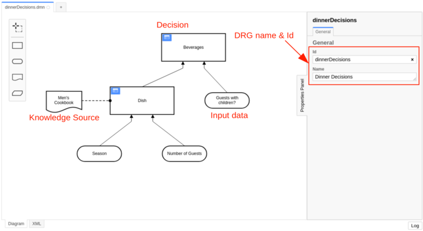
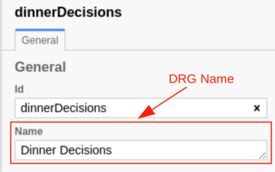
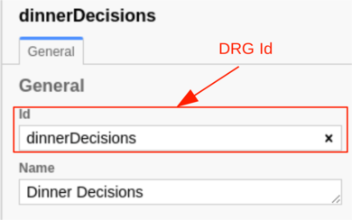
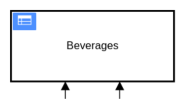
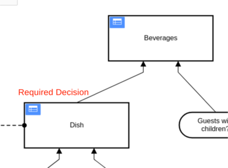
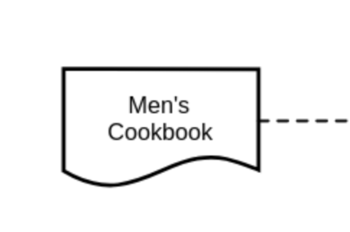

A Decision Requirements Graph (DRG) models a domain of decision-making, showing the most important elements involved in
it and the dependencies between them. The elements modeled are [decisions](#decision), [input data](#input-data),
and [knowledge sources](#knowledge-source).

The visual representation of a DRG is called Decision Requirements Diagram (DRD).

In the XML a DRG is represented by the `definitions` element.

```xml

<definitions xmlns="https://www.omg.org/spec/DMN/20191111/MODEL/" id="dinnerDecisions" name="Dinner Decisions"
             namespace="http://camunda.org/schema/1.0/dmn">
    <decision id="dish" name="Dish">
        <!-- ... -->
    </decision>
    <decision id="beverages" name="Beverages">
        <!-- ... -->
    </decision>
</definitions>
```

## Decision requirements graph name



The name describes the DRG. It is set as the `name` attribute on the `definitions` element.

```xml

<definitions xmlns="https://www.omg.org/spec/DMN/20191111/MODEL/"
             id="dinnerDecisions"
             name="Dinner Decisions"
             namespace="http://camunda.org/schema/1.0/dmn">
    <!-- ... -->
</definitions>
```

## Decision requirements graph id



The id is the technical identifier of the DRG. It is set in the `id` attribute on the `definitions` element.

Each DRG should have an unique id when it is deployed to the Camunda Platform.

```xml

<definitions xmlns="https://www.omg.org/spec/DMN/20191111/MODEL/"
             id="dinnerDecisions"
             name="Dinner Decisions"
             namespace="http://camunda.org/schema/1.0/dmn">
    <!-- ... -->
</definitions>
```

## Decision



A decision requirements graph can have one or more decisions. A decision has a [name](decision-table.md#decision-name)
which is shown in the DRD and an [id](decision-table.md#decision-id). The decision logic inside the decision must be
either a [decision table](decision-table.md) or a [decision literal expression](decision-literal-expression.md).

A decision is represented by a `decision` element inside the `definitions` XML element.

```xml

<definitions xmlns="https://www.omg.org/spec/DMN/20191111/MODEL/" id="dish" name="Desired Dish" namespace="party">
    <decision id="beverages" name="Beverages">
        <decisionTable id="decisionTable">
            <!-- ... -->
        </decisionTable>
    </decision>
</definitions>
```

## Required decisions



A decision can have one or more required decisions which it depends on.

A required decision is represented by a `requiredDecision` element inside an `informationRequirement` XML element. It
has a `href` attribute and the value starts with `#` followed by the [decision id](decision-table.md#decision-id) of the
required decision.

:::tip

The result of a required decision can be accessed in the dependent decision by its decision id.

If the required decision is a decision table and has more than one output then the output values are grouped under the
decision id and can be accessed by their [output names](decision-table-output.md#output-name) (
e.g. `decisionId.outputName`). The structure of the result depends on the decision
table [hit policy](decision-table-hit-policy.md).

:::

```xml

<decision id="beverages" name="Beverages">
    <informationRequirement>
        <requiredDecision href="#dish"/>
    </informationRequirement>
    <!-- ... -->
</decision>
```

## Input data


An input data denotes information used as an input by one or more decisions.

It is represented by an `inputData` element inside the `definitions` element.

```xml

<definitions xmlns="https://www.omg.org/spec/DMN/20191111/MODEL/" id="dinnerDecisions" name="Dinner Decisions"
             namespace="http://camunda.org/schema/1.0/dmn">
    <inputData id="guestsWithChildren" name="Guests with children?"/>

    <decision id="beverages" name="Beverages">
    <informationRequirement>
        <requiredInput href="#guestsWithChildren"/>
    </informationRequirement>
    <!-- ... -->
</definitions>
```

Note that an input data has no execution semantics and is ignored on the evaluation.

## Knowledge source



A knowledge source denotes an authority for a Decision.

It is represented by a `knowledgeSource` element inside the `definitions` element.

```xml

<definitions xmlns="https://www.omg.org/spec/DMN/20191111/MODEL/" id="dinnerDecisions" name="Dinner Decisions"
             namespace="http://camunda.org/schema/1.0/dmn">
    <knowledgeSource id="cookbook" name="Men's Cookbook"/>

    <decision id="dish" name="Dish">
    <authorityRequirement>
        <requiredDecision href="#cookbook"/>
    </authorityRequirement>
    <!-- ... -->
</definitions>
```

Note that a knowledge source has no execution semantics and is ignored on the evaluation.
