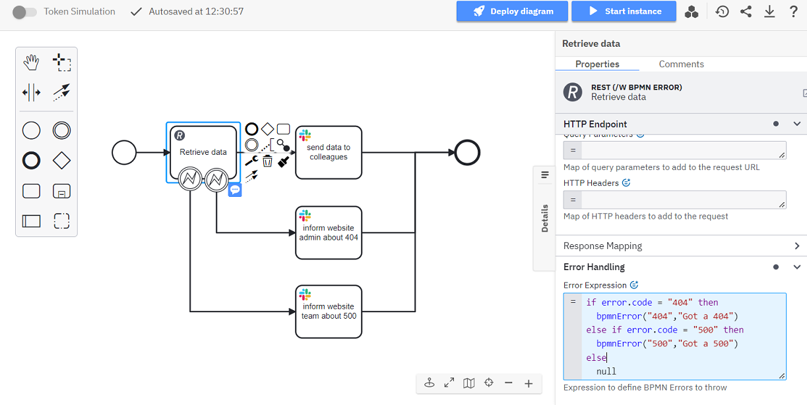

Any task can be transformed into a Connector task. This guide details the basic functionality all Connectors share.
Find the available Connectors in Camunda Platform 8 SaaS and how to use them in detail in the [out-of-the-box Connectors](./out-of-the-box-connectors/available-connectors-overview.md).

## Creating a Connector task

Use the change type context menu item (spanner/wrench icon) to integrate Connectors in a business model. Users can search for keywords like `REST` or `email` to find specific Connectors. To discover all available Connectors in Camunda, input the term Connector into the search bar.


Alternatively, you can directly create a Connector task by using the **Append Connector** context menu item. This creates a new Connector task directly following the currently selected element.


## Configuring a Connector

Once a Connector task is selected, the available configuration is visible in the properties panel on the right side. The required fields are highlighted with an error message.


Fields in the properties panel marked with an equals sign inside a circle indicate that [FEEL](/components/modeler/feel/what-is-feel.md) can be used to configure the property. If the icon includes an equals sign marked with a star, FEEL is required. Using FEEL allows the user to reference process data from variables in the expression to configure the properties.


Each Connector defines its own set of properties that you can fill in. Find the details for Connectors provided by Camunda in the [out-of-the-box Connectors](./out-of-the-box-connectors/available-connectors-overview.md).

## BPMN Errors

Being able to deal with exceptional cases is a common requirement for business process models. Read more about our general best practices around this topic in [dealing with exceptions](/components/best-practices/development/dealing-with-problems-and-exceptions/).

Connectors share this requirement for exception handling like any other task in a model. However, Connectors define reusable runtime behavior that is not aware of your specific business use case. Thus, they can not determine if an exceptional case is a technical or business error.
Therefore, a Connector's runtime behavior can not throw BPMN Errors but only technical errors. However, those technical errors can optionally contain an error code as structured data that can be reused when configuring a Connector task.

### Error Expression

To support flexible exception handling, the [out-of-the-box Connectors](./out-of-the-box-connectors/available-connectors-overview.md) allow to define an **Error Expression** in the **Error Handling** section at the bottom of the properties panel.

The example below uses this property to automatically inform the right group of people depending on the result of an HTTP request against an internal website. If the website returns a valid result, this data is passed on to the regular team.
In case of a [404](https://developer.mozilla.org/en-US/docs/Web/HTTP/Status/404) website response, the administrator is informed, so she can check why the website cannot be reached. HTTP responses with status [500](https://developer.mozilla.org/en-US/docs/Web/HTTP/Status/500)
indicate internal website errors, which is why the website team is informed.



The **Error Expression** property requires a [FEEL](/components/modeler/feel/what-is-feel.md) expression that yields a BPMN Error object in the end. The BPMN Error object can be an empty [context](/components/modeler/feel/language-guide/feel-data-types.md#context),
[null](/components/modeler/feel/language-guide/feel-data-types.md#null), or a context containing at least a non-empty `code`. You can use all available functionality provided by FEEL to produce this result.
Use the provided FEEL function [`bpmnError`](#function-bpmnerror) to conveniently create a BPMN Error object.

Within the FEEL expression, you access the following temporary variables:

- The result of the Connector in `response`.
- Any result variables created by the **Result Variable** and **Result Expression** properties (see the [REST Connector](./out-of-the-box-connectors/rest.md#response), for example).
- The technical exception that potentially occurred in `error`, containing a `message` and optionally a `code`. The code is only available if the Connector's runtime behavior provided a code in the exception it threw.

Building on that, you can cover those use cases with BPMN Errors that you consider as exceptional. This can build on technical exceptions thrown by a Connector as well as regular results returned by the external system you integrated.
The [example expressions](#bpmn-error-examples) below can serve as templates for such scenarios.

### Function bpmnError()

Returns a context entry with a `code` and `message`.

- parameters:
  - `code`: string
  - `message`: string
- result: context

```feel
bpmnError("123", "error received")
// { code: "123", message: "error received" }
```

### BPMN Error Examples

#### HTTP errors to BPMN Errors

Using the [REST Connector](./out-of-the-box-connectors/rest.md), you can handle HTTP errors directly in your business process model:

```feel
if error.code = "404" then
  bpmnError("404", "Got a 404")
else if error.code = "500" then
  bpmnError("500", "Got a 500")
else
  null
```

This will create BPMN Errors for HTTP requests that return with a status [404](https://developer.mozilla.org/en-US/docs/Web/HTTP/Status/404) or [500](https://developer.mozilla.org/en-US/docs/Web/HTTP/Status/500).
You can extend that list to all HTTP errors you can handle as business use cases, e.g. by informing a website administrator directly via Slack using the [Slack Connector](./out-of-the-box-connectors/slack.md).

#### Response value to BPMN Error

Using the [REST Connector](./out-of-the-box-connectors/rest.md) or any other Connector that returns a result, you can handle a response as BPMN Error based on its value:

```feel
if response.body.main.humidity < 0 then
  bpmnError("HUMIDITY-FAIL", "Received invalid humidity")
else null
```

This is assuming you requested data from a local weather station and received a value that is technically valid for the REST Connector.
However, you could define that for your business case a humidity value below 0 must be an error that should be checked manually.
You could automatically send a message to a technician to check the weather station.
