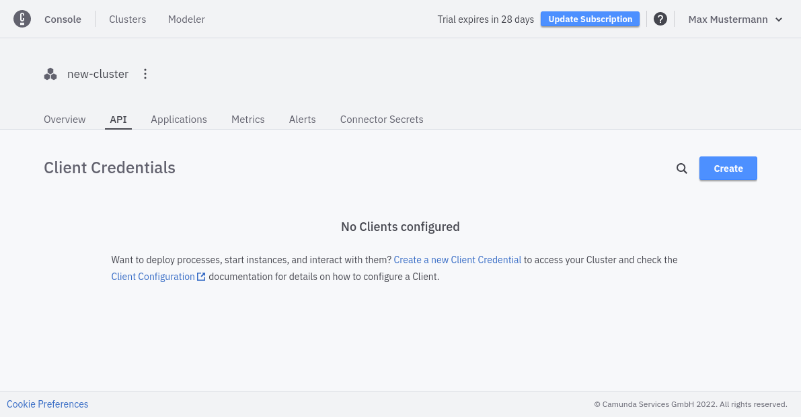

To interact with Zeebe in the cloud from the outside, every client application must authenticate itself. An **OAuth Flow** is therefore used for authentication:

The client configuration is shown at the bottom of the cluster detail view. Create a new client and all necessary information is displayed.

For the `Client Id` and `Client Secret`, a client application can request an access token at the authentication URL (steps 1 and 2). The access token is necessary to interact with Zeebe in the cloud (step 3).

:::note
Access tokens have a validity period that can be found in the access token. After this time, a new access token must be requested.
:::

:::note
The auth service has a built-in rate limit. If too many token requests are executed in a short time, the client is blocked for a certain time. Since the access tokens have a certain validity period, they must be cached on the client side.

The officially offered client libraries (as well as the Node.js client) have already integrated with the auth routine, handle obtaining and refreshing an access token, and make use of a local cache.
:::

### Create a client

To create a client, take the following steps:

1. Navigate into the **API** tab.

2. Click **Create New Client** to create a new client and name your client accordingly.

3. Ensure you keep the generated client credentials in a safe place. The **client secret** will not be shown again. For your convenience, you can also download the client information to your computer.

The downloaded file contains all necessary information to communicate with your Zeebe instance in the future:

- `ZEEBE_ADDRESS`: Address where your cluster can be reached.
- `ZEEBE_CLIENT_ID` and `ZEEBE_CLIENT_SECRET`: Credentials to request a new access token.
- `ZEEBE_AUTHORIZATION_SERVER_URL`: A new token can be requested at this address.