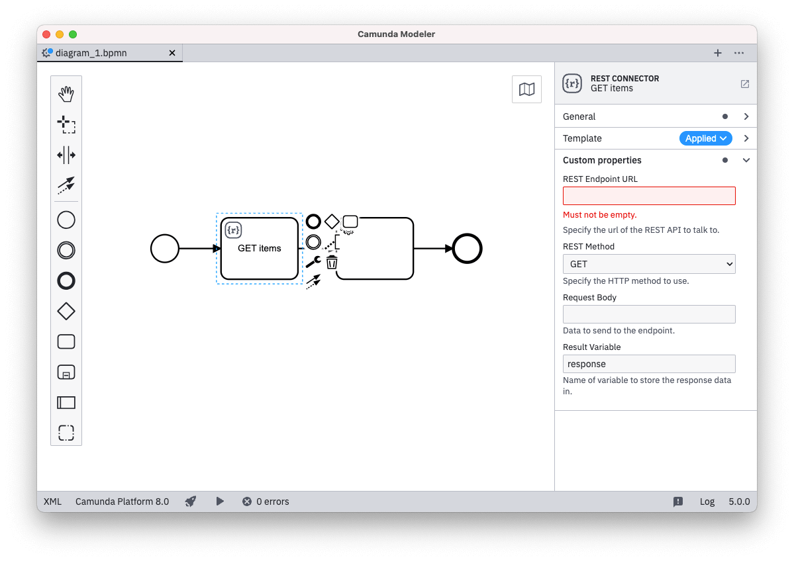

import Tabs from "@theme/Tabs";
import TabItem from "@theme/TabItem";

**Connector templates** are JSON configuration files, which customize how a BPMN element is shown, and how it can be configured by process developers.

You can, for example, allow the user to model and configure the following **REST Connector** by providing a simple JSON configuration:

<Tabs groupId="connectorTemplate" defaultValue="process" values={
[
{label: 'Process modeling view', value: 'process' },
{label: 'Connector template configuration', value: 'json' }
]
}>

<TabItem value='process'>



</TabItem>

<TabItem value='json'>

```json
{
  "$schema": "https://unpkg.com/@camunda/zeebe-element-templates-json-schema/resources/schema.json",
  "name": "(Conditional) REST Connector",
  "id": "io.camunda.examples.ConditionalRestConnector",
  "description": "A REST API invocation task.",
  "appliesTo": ["bpmn:ServiceTask"],
  "icon": {
    "contents": "data:image/svg+xml,%3Csvg xmlns='http://www.w3.org/2000/svg' width='22' height='22' viewBox='0 0 22 22' fill='none'%3E%3Ccircle cx='11' cy='11' r='9' fill='black'/%3E%3Ctext x='6.9' y='14.9' fill='white' style='font-family: Arial; font-size: 10px;'%3EM%3C/text%3E%3C/svg%3E"
  },
  "properties": [
    {
      "type": "Hidden",
      "value": "http",
      "binding": {
        "type": "zeebe:taskDefinition:type"
      }
    },
    {
      "label": "REST Endpoint URL",
      "description": "Specify the url of the REST API to talk to.",
      "type": "String",
      "binding": {
        "type": "zeebe:taskHeader",
        "key": "url"
      },
      "constraints": {
        "notEmpty": true,
        "pattern": {
          "value": "^https?://.*",
          "message": "Must be http(s) URL."
        }
      }
    },
    {
      "id": "httpMethod",
      "label": "REST Method",
      "description": "Specify the HTTP method to use.",
      "type": "Dropdown",
      "value": "get",
      "choices": [
        { "name": "GET", "value": "get" },
        { "name": "POST", "value": "post" },
        { "name": "PATCH", "value": "patch" },
        { "name": "DELETE", "value": "delete" }
      ],
      "binding": {
        "type": "zeebe:taskHeader",
        "key": "method"
      }
    },
    {
      "label": "Request Body",
      "description": "Data to send to the endpoint.",
      "value": "",
      "type": "String",
      "optional": true,
      "binding": {
        "type": "zeebe:input",
        "name": "body"
      },
      "condition": {
        "property": "httpMethod",
        "oneOf": ["patch", "post", "delete"]
      }
    },
    {
      "id": "authenticationType",
      "label": "Authentication Type",
      "description": "Specify the authentication type to use.",
      "type": "Dropdown",
      "value": "",
      "optional": true,
      "choices": [
        {
          "name": "None",
          "value": ""
        },
        {
          "name": "Basic",
          "value": "basic"
        },
        {
          "name": "Bearer",
          "value": "bearer"
        }
      ],
      "binding": {
        "type": "zeebe:input",
        "name": "authentication.type"
      }
    },
    {
      "label": "Username",
      "type": "String",
      "feel": "optional",
      "binding": {
        "type": "zeebe:input",
        "name": "authentication.username"
      },
      "constraints": {
        "notEmpty": true
      },
      "condition": {
        "property": "authenticationType",
        "equals": "basic"
      }
    },
    {
      "label": "Password",
      "type": "String",
      "feel": "optional",
      "binding": {
        "type": "zeebe:input",
        "name": "authentication.password"
      },
      "constraints": {
        "notEmpty": true
      },
      "condition": {
        "property": "authenticationType",
        "equals": "basic"
      }
    },
    {
      "label": "Bearer Token",
      "type": "String",
      "feel": "optional",
      "binding": {
        "type": "zeebe:input",
        "name": "authentication.token"
      },
      "constraints": {
        "notEmpty": true
      },
      "condition": {
        "property": "authenticationType",
        "equals": "bearer"
      }
    }
  ]
}
```

</TabItem>
</Tabs>

## Develop Connector templates

You can develop Connector templates using the [`element template` feature](../../../modeler/desktop-modeler/element-templates/defining-templates.md). You can also look at existing [examples](https://github.com/camunda/camunda-modeler/blob/master/resources/element-templates/cloud-samples.json).

## Providing and using Connector templates

When using [Web Modeler](../../../modeler/web-modeler/launch-cloud-modeler.md), you can create **Connector templates** [directly within the application](../../../modeler/web-modeler/advanced-modeling/manage-connector-templates.md) and then share them with your respective organization.

When using [Desktop Modeler](../../../modeler/desktop-modeler/install-the-modeler.md), you must place the **Connector templates** [within the file system](../../../modeler/desktop-modeler/element-templates/configuring-templates.md) so the modeler will pick them up.

Once available, process developers can directly [use the **Connector templates** from within the modeling canvas](../use-connectors.md).
