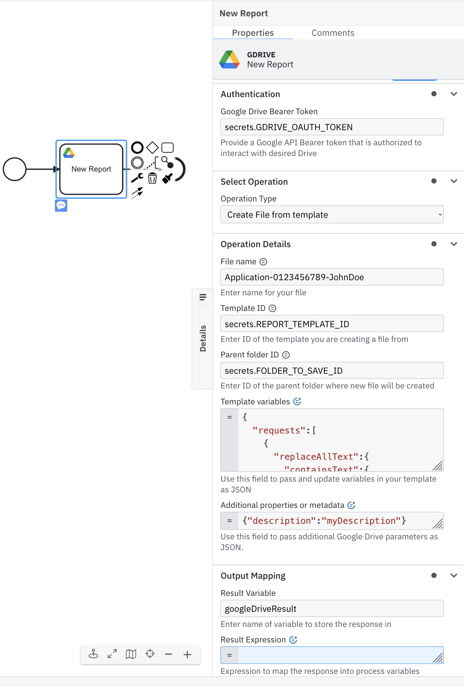
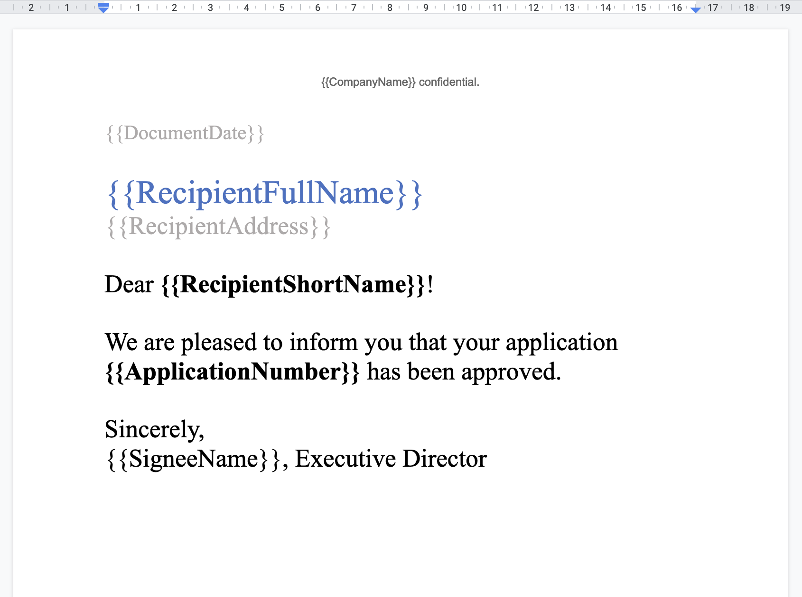
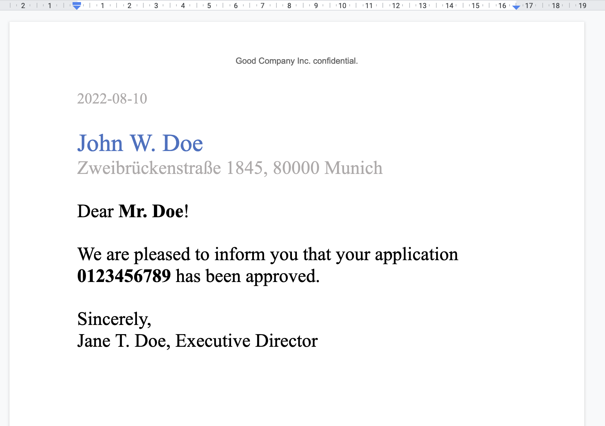

The **Google Drive connector** allows you to create empty folders or documents from templates from your BPMN process.

## Prerequisites

To start working with the **Google Drive connector**, a relevant OAuth token must be configured and stored as a secret in the user's cluster. The token must have permission to read and create a folder and/or files from a desired Google Drive instance. Follow the steps from the appendix to find out more about creating an OAuth token and giving relevant permissions.

## Create a Google Drive connector task

Currently, the **Google Drive connector** supports two flavors: create a new folder and create a file from a template.

To use a **Google Drive connector** in your process, either change the type of existing task by clicking on it and using the wrench-shaped **Change type** context menu or create a new connector task by using the **Append connector** context menu. Follow our guide on using connectors to learn more.

## Make your Google Drive connector for creating a folder executable

To make the **Google Drive connector** executable, fill out the mandatory fields highlighted in red in the properties panel:


1. In the **Authentication** section, set the field **Google Drive Bearer Token** to your OAuth token; for example, `secrets.GDRIVE_OAUTH_TOKEN`.
2. In the **Select Operation** section, set the field value **Operation Type** as **Create Folder**.
3. In the **Operation Details** section, set the field **Folder name** as the desired name of a folder you wish to create. For example, `MyNewFolder`. Alternatively, you could use a FEEL expression.
4. _(optional)_ In the **Operation Details** section, set the field **Parent folder ID** to the desired parent, inside which a new folder will be created. Keep in mind that if not specified, a new folder will be created in the Google Drive root folder of a user who owns the OAuth token.
5. _(optional)_ In the **Operation Details** section, set the field **Additional properties or metadata**, set Google Drive compatible properties or metadata. This property requires FEEL input. Check the appendix for known values and limitations.

## Make your Google Drive connector for creating a file from template executable

To make the **Google Drive connector** executable, fill out the mandatory fields highlighted in red in the properties panel:



1. In the **Authentication** section, set the field Google Drive Bearer Token to your OAuth token, for example, `secrets.GDRIVE_OAUTH_TOKEN`.
2. In the **Select Operation** section, set the field value **Operation Type** as **Create File from template**.
3. In the **Operation Details** section, set the field **File name** as the desired name of a folder you wish to create. You can use FEEL expressions here.
4. In the **Operation Details** section, set the field **Template ID** of the desired template.
5. _(optional)_ In the **Operation Details** section, set the field **Parent folder ID** to the desired parent, inside which a new file will be created. Keep in mind that if not specified, a new folder will be created in the Google Drive root folder of a user who owns the OAuth token.
6. In the **Operation Details** section, set the field **Template variables** as desired variables that will be applied to the template. The template variables a compatible with the Google Docs Requests API. This property requires FEEL input.
7. _(optional)_ In the **Operation Details** section, set the field **Additional properties or metadata**, set Google Drive compatible properties or metadata. This property requires FEEL input. Check the appendix for known values and limitations.

## Google Drive connector response

The **Google Drive connector** exposes Google Drive API response as a local variable called response.
The following fields are available in the response variable:

- `googleDriveResourceId` - ID of a newly created resource.
- `googleDriveResourceUrl` - Human-readable URL of a newly created resource.

You can use an output mapping to map the response:

1. Use **Result Variable** to store the response in a process variable. For example, `myResultVariable`.
2. Use **Result Expression** to map fields from the response into process variables. For example:

```
{
  "googleDriveResourceId":"1KMG4S_18kLNZa7ZCARtGIh8DmIoXXXXXXXXX",
  "googleDriveResourceUrl":"https://docs.google.com/document/d/1KMG4S_18kLNZa7ZCARtGIh8DmIoXXXXXXXXX"
}
```

## Appendix & FAQ

### How can I get Google Drive OAuth token?

Refer to the official Google Drive API documentation page.

### I wish to do an ad-hoc test of the Google Drive connector without setting up complex OAuth flows. How can I do that?

While this is highly not recommended due to security concerns, in certain cases, such as learning, exploring possibilities, or preparing a demo, you can still obtain a Google API token.

For that, you will need to create a service account, and generate and download its keys. After that, you can execute this Python script which will produce your OAuth token:

```
import google.auth
import google.auth.transport.requests
from google.oauth2 import service_account

SCOPES = ['https://www.googleapis.com/auth/drive', 'https://www.googleapis.com/auth/drive.file', 'https://www.googleapis.com/auth/drive.appdata']
SERVICE_ACCOUNT_FILE = 'google-service-account-creds.json'

credentials = service_account.Credentials.from_service_account_file(SERVICE_ACCOUNT_FILE, scopes=SCOPES)
auth_req = google.auth.transport.requests.Request()
credentials.refresh(auth_req)
print(credentials.token)
```

### Where do I get a parent folder ID?

It is in the URL.


### How do I set additional properties or metadata?

You can set any property from the Google Drive Create API. For example:

```
= {
  "description":"myDescription"
}
```

The unknown or mistyped properties will be ignored.

### What are the limitations of the additional properties or metadata?

Some properties are applicable only for the token owners, like `folderColorRgb` and `starred`.

### Where do I get Template ID?

It is in the URL.


### Can you show me an example of a valid template?

The valid template looks like the one on a screenshot.



Now, in the Template variables field we can apply the following FEEL JSON object which must be compatible with the Google Docs Requests API:

```
= {
  "requests":[
    {
      "replaceAllText":{
        "containsText":{
          "text":"{{DocumentDate}}",
          "matchCase":"true"
        },
        "replaceText":today()
      }
    },
    {
      "replaceAllText":{
        "containsText":{
          "text":"{{RecipientFullName}}",
          "matchCase":"true"
        },
        "replaceText":"John W. Doe"
      }
    },
    {
      "replaceAllText":{
        "containsText":{
          "text":"{{RecipientAddress}}",
          "matchCase":"true"
        },
        "replaceText":"Zweibrückenstraße 1845, 80000 Munich"
      }
    },
    {
      "replaceAllText":{
        "containsText":{
          "text":"{{RecipientShortName}}",
          "matchCase":"true"
        },
        "replaceText":"Mr. Doe"
      }
    },
    {
      "replaceAllText":{
        "containsText":{
          "text":"{{ApplicationNumber}}",
          "matchCase":"true"
        },
        "replaceText":"0123456789"
      }
    },
    {
      "replaceAllText":{
        "containsText":{
          "text":"{{SigneeName}}",
          "matchCase":"true"
        },
        "replaceText":"Jane T. Doe"
      }
    },
    {
      "replaceAllText":{
        "containsText":{
          "text":"{{CompanyName}}",
          "matchCase":"true"
        },
        "replaceText":"Good Company Inc."
      }
    }
  ]
}
```

The result should be as on a screenshot:



### What kind of templates are currently supported?

The Google Drive Connector currently supports only Google Doc files (MIME type `application/vnd.google-apps.document`).
