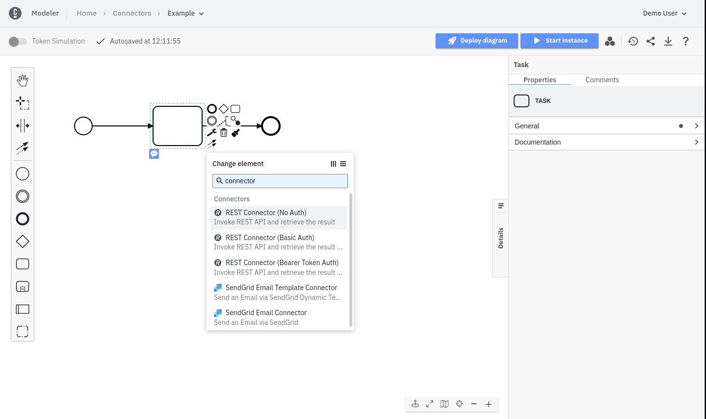
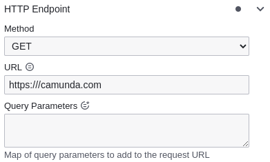

Any task can be transformed into a connector task using the change type context menu item (spanner/wrench icon) to integrate connectors in a business model. Users can search for keywords like `REST` or `email` to find specific connectors. To discover all available connectors in Camunda, input the term connector into the search bar.

Alternatively, you can directly create a connector task by using the **Append connector** context menu item. This creates a new connector task directly following the currently selected element.

Once a connector task is selected, the available configuration is visible in the properties panel on the right side. The required fields are highlighted with an error message.

Fields in the properties panel marked with an equals sign inside a circle indicate that [FEEL](/components/modeler/feel/what-is-feel.md) can be used to configure the property. If the icon includes an equals sign marked with a star, FEEL is required. Using FEEL allows the user to reference process data from variables in the expression to configure the properties.

Find the available connectors in Camunda Platform 8 SaaS and how to use them in the [following pages](./out-of-the-box-connectors/available-connectors-overview.md).
