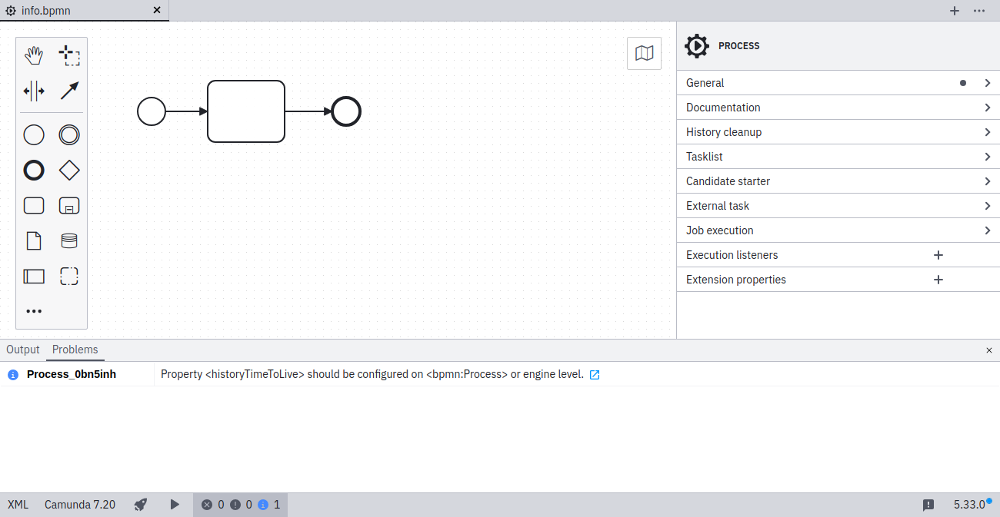

import MarkerGuideline from "@site/src/mdx/MarkerGuideline";

Camunda 7 only

Each execution of a model resource (BPMN, DMN, and CMMN) generates historic data during execution that is stored in the database. In Camunda 7, [history cleanup](https://docs.camunda.org/manual/latest/user-guide/process-engine/history/) removes this historic data from the database based on a defined **history time to live (HTTL)**.

From [Camunda 7.20](https://docs.camunda.org/manual/develop/update/minor/719-to-720/#enforce-history-time-to-live) onwards, you must configure HTTL in one of the following ways:

- Define HTTL per model directly in Desktop Modeler.
- Set a default HTTL via an engine configuration.
- Switch off the HTTL check via an engine configuration if history cleanup is not used.

## <MarkerGuideline.Info /> History time to live not configured

## References

- [History documentation](https://docs.camunda.org/manual/latest/user-guide/process-engine/history/)
- [Camunda 7.20 migration](https://docs.camunda.org/manual/develop/update/minor/719-to-720/#enforce-history-time-to-live)
- [Rule source](https://github.com/camunda/bpmnlint-plugin-camunda-compat/blob/main/rules/camunda-platform/history-time-to-live.js)
