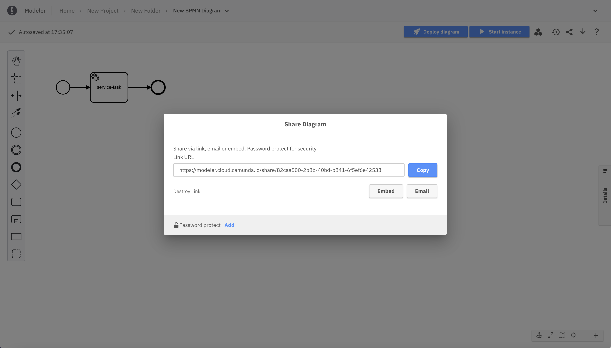
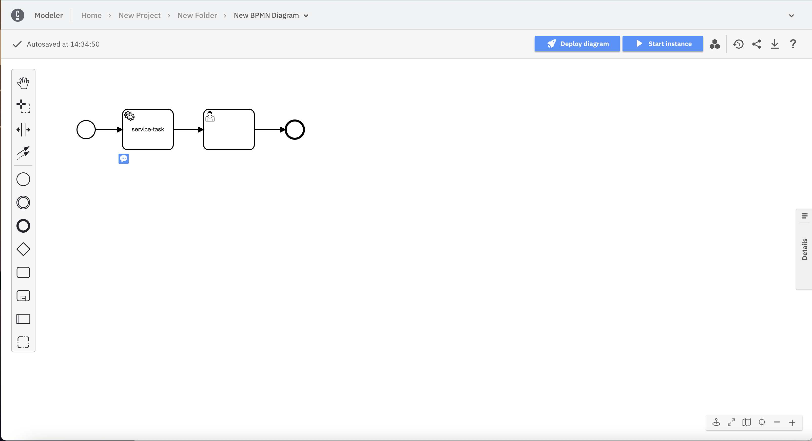
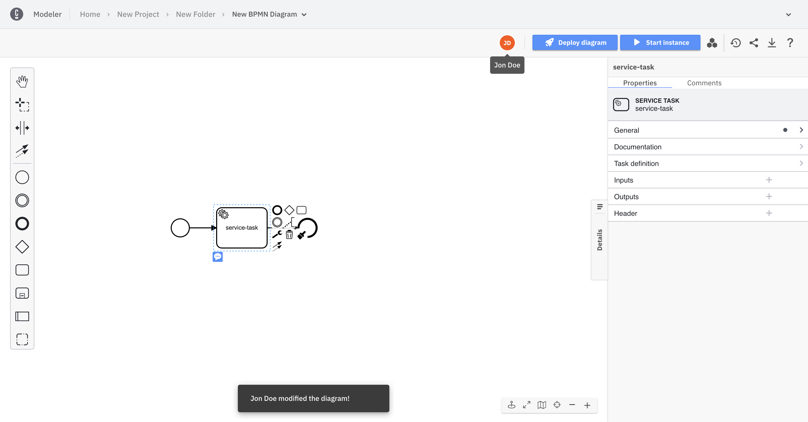

## Projects

Files and folders are stored in projects.
The user access on files and folders is defined at the project level.

When you access Web Modeler via the Cloud menu, you see the Home page with all the projects you can access:

###  Access rights and permissions

Users can have various level of access to a project in Web Modeler.

After creating a project, you can invite members of your Camunda Cloud organization to collaborate in Web Modeler.
There are four roles with different levels of access rights that can be assigned to each user:

* **Project Admin:** the user can edit the project itself, all folders and diagrams within the project and invite more users to collaborate.
* **Editor:** the user can edit all folders and diagrams within the project.
* **Commenter:** the user cannot edit folders or diagrams nor invite users, but can view and leave comments on diagrams.
* **Viewer:** the user cannot edit folders or diagrams nor leave comments, but can only view diagrams.

### Inviting users to Projects

On the right side of a Project you can see a list of your collaborators and invite more.

1. Click on **Add User**:

2. Choose a role for your new collaborator

3. Start typing and Web Modeler will suggest Camunda Cloud organization members that you can invite to the project

4. Write a message to your new collaborator

5. Click on **Send** and your new collaborator will receive an email with the invitation

### Folders

You can create folders in a project to semantically group and organize your diagrams.
The user access on a folder is inherited from the project.

## Sharing and embedding diagrams

Diagrams can also be shared with others in read-only mode via a sharing link.
This link can also be protected with an additional password.

1. Navigate to a diagram and click on the share icon button

2. Click on **Create link**

3. Click on **Copy** to copy the link to your clipboard

4. Click on **Add** and type a new password to protect your link

5. Click on **Email** to share the new link with multiple recipients

Similar to the sharing link, a diagram can be embedded into HTML pages via an iframe tag. The iframe tag can be copied from the sharing dialog via the **Embed** button.

For wiki systems like [Confluence](https://www.atlassian.com/software/confluence), we recommend using the HTML macro and adding the iframe tag from the sharing dialog. This way, diagrams can be easily included in documentation pages. To adjust the dimensions of the diagram, the width and height values of the iframe tag can be modified.

## Comments

When selecting an element of the BPMN diagram, a discussion can be attached to this element. If no element is selected, then the discussion will be attached directly to the diagram.
You can easily switch between the Properties Panel and Comments using the two tabs present at the top of the right side panel

New comments can be added to the discussion by any collaborator with Admin, Editor or Commenter access rights.
Afterwards, the comment can be edited or deleted via the context menu icon.

Elements with discussions attached will always have a visible blue overlay so you can easily identify discussion points.

### Mention others in comments

By typing the ‘@’ character, you are able to filter the collaborators on the project and select one of them.

When submitting the comment, this user will receive an email as a notification about the new comment.

## Interact with your collaborators

### Model a diagram together

When others are opening the same diagram as you, the updates on the diagram are sent in real time. You can also see who is in the diagram with you.

### Draw other's attention

Whether you are in a presentation or if others are in the same diagram as you are, use the attention grabber pointer to draw attention to a specific part of the diagram.

1. Switch on the attention grabber pointer from the canvas tools

2. And drop the pointer by clicking anywhere on the canvas

The pointer will pulsate to draw attention and will match your avatar color.
It can also be seen in real-time by others that are looking at the same diagram as you.

