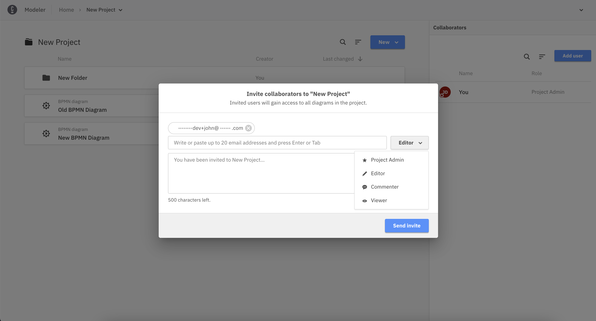
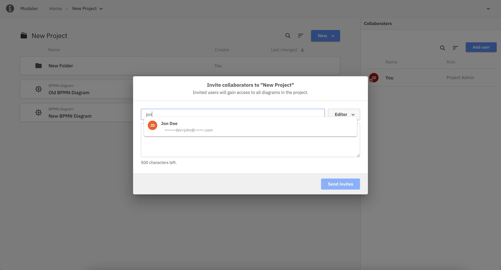
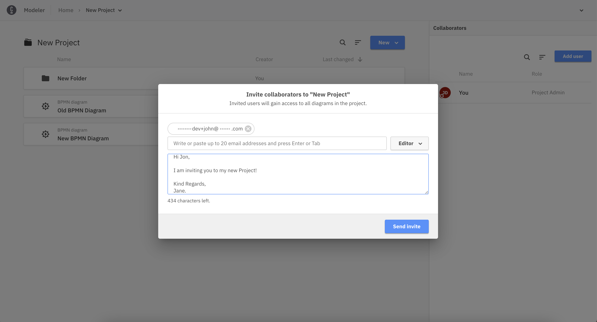
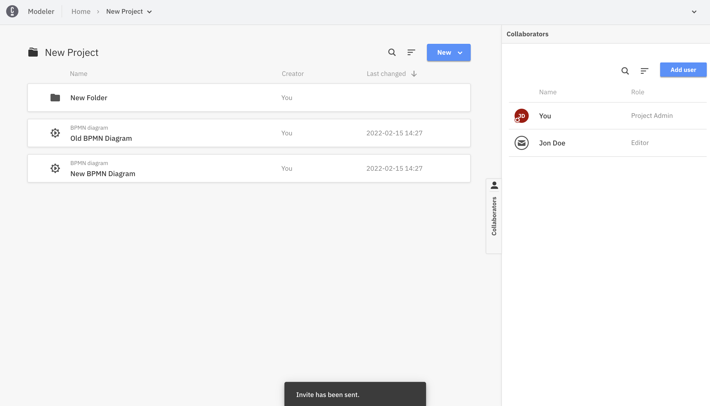
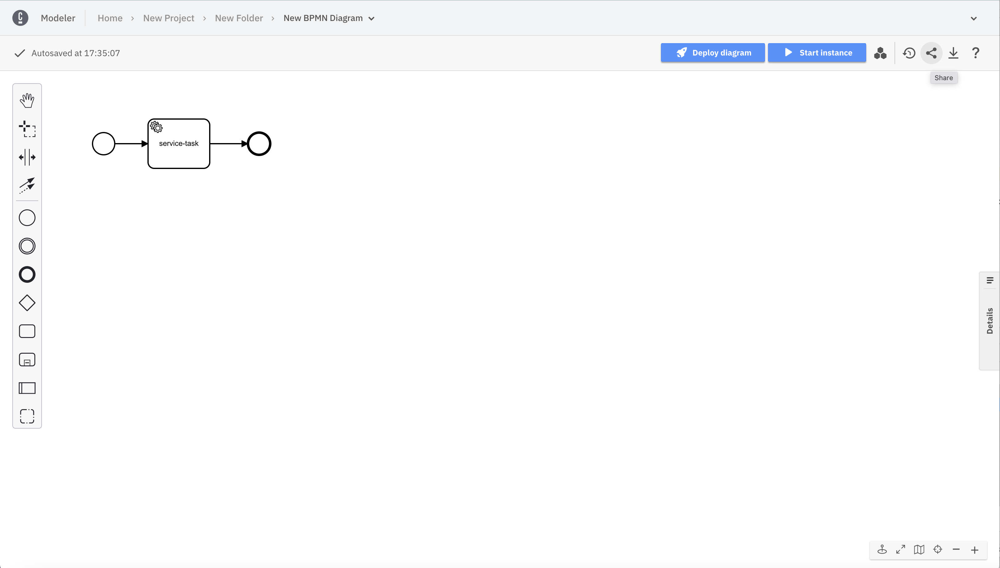
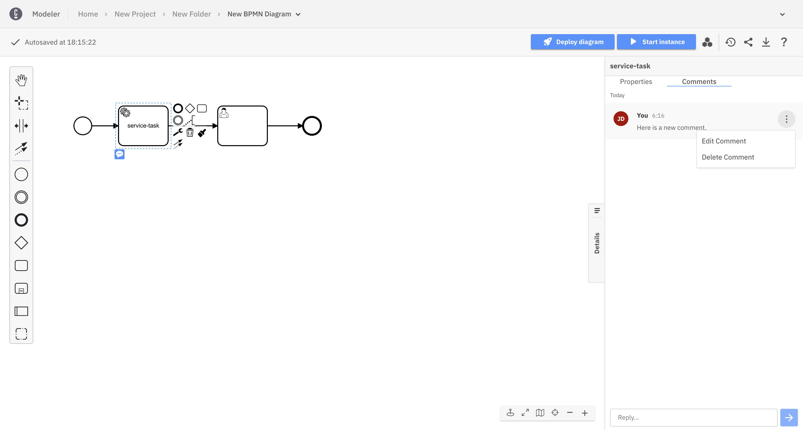

import SuperUserModeImg from './img/super-user-mode.png';

Camunda 8 only

## Projects

Files and folders are stored in projects.
The user access on files and folders is defined at the project level.

When you access Web Modeler via the Camunda 8 dashboard, you can note the **Home** page with all the projects you can access:

### Access rights and permissions

Users can have various levels of access to a project in Web Modeler, outlined in this section.

After creating a project, you can invite members of your Camunda 8 organization to collaborate in Web Modeler.
There are four roles with different levels of access rights that can be assigned to each user:

- **Project Admin**: The user can edit the project itself, all folders and diagrams within the project, and invite more users to collaborate.
- **Editor**: The user can edit all folders and diagrams within the project.
- **Commenter**: The user cannot edit folders or diagrams or invite users, but can view diagrams and properties and leave comments.
- **Viewer**: The user cannot edit folders or diagrams nor leave comments, but can only view diagrams.

Additionally, the **Owner** and **Admins** of the organization have special privileges to do administrative tasks in **super-user mode**.

#### Super-user mode

:::note
Super-user mode is not yet available in Web Modeler Self-Managed.
:::

Super-user mode is only available to the **Owner** and **Admins** of the organization and can be enabled via the user menu in Web Modeler:

The main purpose of this mode is to assign collaborators to orphaned projects (which have no collaborators).
Ordinarily, these projects would not be accessible or visible to any users.

When the **Owner** or an **Admin** activates super-user mode, they are temporarily granted **Project Admin** access to all projects
of the organization. This allows them to assign collaborators to orphaned projects and gives them
full access when none of the ordinary collaborators are available.

### Inviting users to projects

:::note
Users without email addresses will not receive any kind of notification about project invitations.
:::

On the right side of a project, view a list of your collaborators and invite more by taking the steps below:

1. Click **Add user**.
   

2. Choose a role for your new collaborator.
   

3. Begin typing the name or email of the individual and Web Modeler will suggest Camunda 8 organization members that you can invite to the project.
   

4. Write a message to your new collaborator about their invitation to the project.
   

5. Click **Send** and your new collaborator will receive an email with the invitation.
   
   

### Invitation limit

:::note
The invitation limit only applies to Self-Managed Non-production installations.
:::

Starting with `8.6.0-alpha2` Web Modeler Self-Managed will be available for unlicensed installations.
You can read more about the new licensing here (TODO link).
In this case, the number of collaborators per project is limited to five, including the project administrator.
Whether a licence is activated can be seen in the top right corner of the navigation bar.

### Folders

You can create folders in a project to semantically group and organize your diagrams.
The user access on a folder is inherited from the project.

## Sharing and embedding diagrams

Diagrams can also be shared with others in read-only mode via a sharing link.
This link can also be protected with an additional password.

1. Navigate to a diagram and click on the share icon button.
   

2. Click **Create link**.
   

3. Click **Copy** to copy the link to your clipboard.
   

4. Click **Add** and type a new password to protect your link.
   

5. Click **Email** to share the new link with multiple recipients.
   

Similar to the sharing link, a diagram can be embedded into HTML pages via an iframe tag. The iframe tag can be copied from the sharing dialog via the **Embed** button.

For wiki systems like [Confluence](https://www.atlassian.com/software/confluence), we recommend using the HTML macro and adding the iframe tag from the sharing dialog. This way, diagrams can be easily included in documentation pages. To adjust the dimensions of the diagram, the width and height values of the iframe tag can be modified.

## Comments

When selecting an element of the BPMN diagram, a discussion can be attached to this element. If no element is selected, the discussion will be attached directly to the diagram.
Switch between the **Properties Panel** and **Comments** using the two tabs present at the top of the right side panel.

New comments can be added to the discussion by any collaborator with Admin, Editor, or Commenter access rights.

Afterwards, the comment can be edited or deleted via the context menu icon.

Elements with discussions attached will always have a visible blue overlay, so you can easily identify discussion points.

### Mention others in comments

By typing the **@** character, you are able to filter the collaborators on the project and select one of them.

When submitting the comment, this user will receive an email as a notification about the new comment.

:::note
Users without email addresses will not receive any kind of notification about being mentioned in a comment.
:::

## Interact with your collaborators

### Model a diagram together

When others are opening the same diagram as you, the updates on the diagram are sent in real time. You can also note who is in the diagram with you.

### Draw other's attention

Whether you are in a presentation or if others are in the same diagram as you are, use the attention grabber pointer to draw attention to a specific part of the diagram. To do this, take the following steps:

1. Switch on the attention grabber pointer from the canvas tools.
   

2. Drop the pointer by clicking anywhere on the canvas.
   

The pointer will pulsate to draw attention and will match your avatar color.
It can also be seen in real-time by others that are looking at the same diagram as you.
