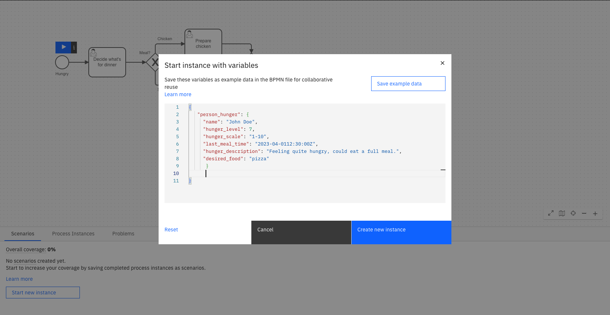
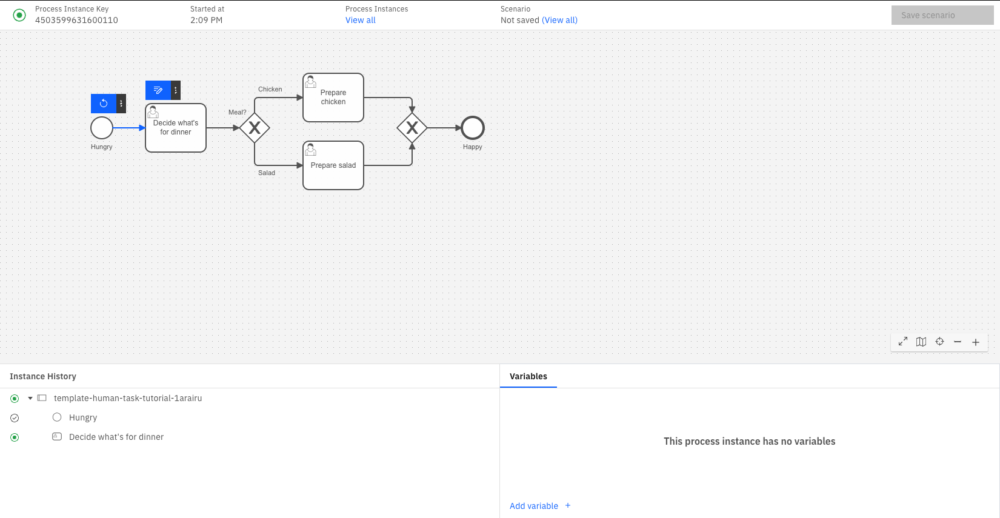
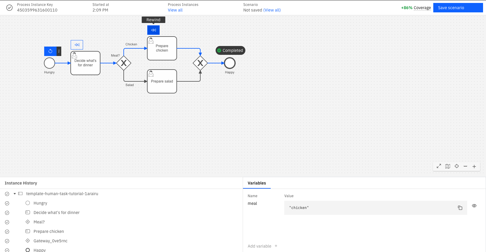

Camunda 8 only

Play is a Zeebe-powered playground environment within Web Modeler for validating a process at any stage of development. Developers can debug their process logic, testers can manually test the process, and process owners can demo to stakeholders - all within Play.

## Opening Play

To use Play, open a BPMN diagram and click the **Play** tab. Read the [limitations and availability section](#limitations-and-availability) if this section is missing.

In Self-Managed, you will be prompted to provide the [details](#use-play-with-camunda-self-managed) of your cluster:

This starts a Play environment that utilizes your selected development cluster in SaaS, or the specified cluster in a Self-Managed setup.

The current version of the active process and all its dependencies, like called processes or DMN files, are automatically deployed to the Play environment. An error or warning is raised if a file fails to deploy, is missing, or a Connector secret isn’t filled out.

In SaaS, Play uses Connector secrets from your selected cluster. Connector secrets are not currently supported in Self-Managed.

## Get started with Play

The first view in Play is the process definition view. It shows deployment problems, active process instances, and start events.

Click a **start event's** play button to begin your process. Open the button's menu to start a process with variables. These variables can also be prefilled from the example data defined for the start event in **Implement** mode.

Alternatively, save example data to the BPMN file directly from the modal in Play to reuse it in future sessions or share it with others.

Play presents this example data in a readable JSON format, as illustrated below. See [data handling](/components/modeler/data-handling.md) for additional details.

## Play a process

Click the action icons next to a task or event to play the process.

The **Instance History** panel tracks the path taken throughout the diagram.

The **Variables** panel tracks the data collected. Global variables are shown by default. To view local variables, select the corresponding task or event. Variables can be edited or added here, and Play supports JSON format to represent complex data.

Play executes all logic of the process and its linked files, such as FEEL, forms, DMN tables, and outbound Connectors.

Actions in Play can be initiated through Operate, Tasklist, or external APIs. For example, you can complete a user task via Tasklist, finish a service task using an external job worker, or cancel/modify your instance through Operate, with all changes reflected in Play.

In SaaS, view your process instance in Operate by selecting the **Process Instance Key** in the header.

You have a few options to mock an external system:

- In **Implement** mode, hard-code an example payload in the task or event's **Example data** section in the properties panel.
- When completing a task or event, use the secondary action to complete it with variables.
- When filling forms or setting variables from Play, you can also save the variables to the BPMN file as example data to reuse them in future sessions.
- Use service task placeholders instead of connectors

Play automatically uses example data from the BPMN file for many events and task types.
If you want to use different data, you can override the example data by opening the secondary action menu on an element.
The new data set will take precedent over the example data from the BPMN file for future Play sessions.

Incidents are raised in Play just like in Operate. Use the variables and incident messages to debug the process instance.

## Replay a process

To replay a process, rewind to an earlier element by clicking on the **Rewind** button on a previously completed element.

:::note
You can also return to the definition view by clicking **View all** on the top banner, or start a new process instance by clicking on the **Restart process** button on the start event.
:::

### Rewind a process

After completing part of your process, you can **rewind** to a previous element to test a different scenario. Play will start a new instance and replay your actions up to, but not including, the selected previous task.

Play's rewind operation currently does not support the following elements:

- Call activities
- Timer events that complete without being skipped

#### Additional limitations

- If you completed an unsupported element before rewinding, you will rewind farther than expected.
- Play rewinds to an element, not to an element instance. For example, if you wanted to rewind your process to a sequential multi-instance service task which ran five times, it will rewind your process to the first instance of that service task.
- Play rewinds processes by initiating a new instance and executing each element. However, if any element behaves differently from the previous execution, such as a Connector returning a different result, the rewind may fail.

## Modify a process instance

There are two main reasons to modify a process instance in Play:

1. **Skip elements**: If your process is stuck, you can continue testing by skipping over elements. For instance, rather than waiting for a 24-hour timer event to elapse or resolving an incident, you can manually advance the active token from the timer event to the next flow node.
2. **Faster prototyping**: Rather than completing the entire process, you can skip over unnecessary sections of a large diagram to debug the changes you made.

There are three ways to modify your process instance:

- **Add token**: Select the flow node where you'd like to initiate a new token and select **Add** from the modification dropdown.
- **Cancel tokens**: Select the flow node where you'd like to cancel active tokens and select **Cancel** from the modification dropdown.
- **Move tokens**: Select the flow node from which you'd like to move active tokens and select **Move** from the modification dropdown. Then, select a target flow node to relocate the tokens.

:::note
Unlike in [Operate](/components/operate/userguide/process-instance-modification.md), these changes are applied immediately. If you need to change variables while modifying a process, use the **Variables** panel to set them separately. Alternatively, for advanced use cases you can modify the process instance from Operate.
:::

### Limitations

Rewinding a process instance that has modifications applied to is currently not supported. Additionally, some elements do not support specific modifications:

- **Add token**/**Move tokens to** modifications are not possible for the following element types:
  - Start events
  - Boundary events
  - Events attached to event-based gateways
- **Move tokens from** modification is not possible for a subprocess itself.
- **Add token**/**Move tokens to** modifications are currently not possible for elements with multiple running scopes.
- All tokens of a multi-instance element are moved or canceled at the same time.

## Rapid iteration

To make changes, switch back to **Implement** mode. When returning to Play, your process is redeployed. Play only shows process instances from the process’s most recent version, so you may not see your previous instances.

Play saves your inputs when completing user task forms. It auto-fills your last response if you open the same form later in the session. You can click **Reset** to reset the form to its defaults.

## Details

Depending on the BPMN element, there may be a different action:

- **User tasks** with an embedded form are displayed on click. However, you cannot track assignment logic.
- **Call activities** can be navigated into and performed.
- **Manual tasks**, **undefined tasks**, **script tasks**, **business rule tasks**, **gateways**, **outbound Connectors** and other BPMN elements that control the process’s path are automatically completed based on their configuration.
- **Service tasks**, **inbound Connectors**, message-related tasks, or events are simulated on click or triggered from an external client. However, Play attempts message correlation based on the process context but cannot infer keys from FEEL expressions. Therefore, these keys must be manually entered by publishing a message using secondary actions.
- Many action icons have secondary actions. For example, **user tasks** can be completed with variables rather than a form, and **service tasks** can trigger an error event.

## Operate vs. Play

[Operate](/components/operate/operate-introduction.md) is designed to monitor many production process instances and intervene only as necessary, while Play is designed to drive a single process instance through the process and mock external systems.

Both offer monitoring of a single process instance, its variables and path, incidents, and actions to modify or repair a process instance. Operate offers bulk actions and guardrails against breaking production processes, while Play offers a streamlined UX to run through scenarios quickly.

## Limitations and availability

Play is being rebuilt and progressively rolled out to more users. This section explains why you might not see the **Play** tab, and any additional limitations.

For more information about terms, refer to our [licensing and terms page](https://legal.camunda.com/licensing-and-other-legal-terms#c8-saas-trial-edition-and-free-tier-edition-terms).

### Camunda 8 SaaS

In Camunda 8 SaaS, Play is available to all Web Modeler users with commenter, editor, or admin permissions within a project.
Additionally, within their organization, users need to have a [role](/components/console/manage-organization/manage-users.md#roles-and-permissions) which has deployment privileges.
Enterprise users need an admin to enable Play by opting in to [alpha features](/components/console/manage-organization/enable-alpha-features.md).

### Camunda 8 Self-Managed

:::note
To use Play with Docker, ensure OAuth is enabled for your configured components. The `docker-compose-core.yaml` file in the Camunda [platform repository](https://github.com/camunda/camunda-platform) does not provide authentication, and cannot be used with Play.
:::

In Self-Managed, Play is controlled by the `PLAY_ENABLED` [configuration property](/self-managed/modeler/web-modeler/configuration/configuration.md#feature-flags) in Web Modeler. This is `true` by default for the Docker and Kubernetes distributions.

Prior to the 8.6 release, Play can be accessed by installing the 8.6.0-alpha [Helm charts](https://github.com/camunda/camunda-platform-helm/tree/main/charts/camunda-platform-alpha), or running the 8.6.0-alpha [Docker Compose](https://github.com/camunda/camunda-platform/tree/main/docker-compose/camunda-8.6) configuration.

### Features

- [Decision table rule](/components/modeler/dmn/decision-table-rule.md) evaluations are not viewable from Play. However, they can be inferred from the output variable, or can be viewed from Operate.
- Currently, Play supports displaying up to 100 flow node instances in the instance history panel, 100 variables in the variables panel, and 100 process instances on the process definition page. To access all related data, you can use Operate.
- While you can still interact with your process instance in Play (for example, completing jobs or publishing messages), you may be unable to resolve incidents if they occur beyond the 100th flow node instance, as Play does not track them. In this case, incident resolution can be managed in Operate.
- Play doesn't support call activities with [FEEL expressions](/components/modeler/feel/what-is-feel/).

## Use Play with Camunda Self-Managed

After selecting the **Play** tab in Self-Managed, you are prompted to provide the details of your cluster.

See the table below for the requirement for each field, as well as an example value:

| Name              | Description                                     | Example value                                                                      |
| ----------------- | ----------------------------------------------- | ---------------------------------------------------------------------------------- |
| Cluster endpoint  | Address where your cluster can be reached       | `http://zeebe:26500`                                                               |
| Operate base url  | Address where Operate can be reached            | `http://operate:8080`                                                              |
| Operate audience  | Permission name for Operate                     | `operate-api`                                                                      |
| Tasklist base url | Address where Tasklist can be reached           | `http://tasklist:8080`                                                             |
| Tasklist audience | Permission name for Tasklist                    | `tasklist-api`                                                                     |
| Zeebe rest url    | Address where the Zeebe REST API can be reached | `http://zeebe:8080`                                                                |
| Client ID         | Name of your registered client                  | `zeebe`                                                                            |
| Client secret     | Password for your registered client             | `zecret`                                                                           |
| OAuth token url   | Token issuer server                             | `http://keycloak:18080/auth/realms/camunda-platform/protocol/openid-connect/token` |
| OAuth audience    | Permission name for Zeebe                       | `zeebe-api`                                                                        |

### Limitations

The environment variables `CAMUNDA_CUSTOM_CERT_CHAIN_PATH`, `CAMUNDA_CUSTOM_PRIVATE_KEY_PATH`, `CAMUNDA_CUSTOM_ROOT_CERT_PATH`, and `CAMUNDA_CUSTOM_ROOT_CERT_STRING` can be set in Docker or Helm chart setups. However, these configurations have not been tested with Play's behavior and, therefore, are not supported when used with Play.

## Play Usage and Billing Considerations

The use of Play may result in additional charges depending on your organization's plan and the type of cluster you are using. To avoid extra costs, follow these guidelines based on your plan:

- **Enterprise Plans:** Use a [development cluster](/components/concepts/clusters.md#development-clusters-in-the-enterprise-plan) to avoid costs. Alternatively, ensure your organization is designated as a development organization. For further assistance, contact your Customer Success Manager.
- **Starter/Professional Plans:** Use a [development cluster](/components/concepts/clusters.md#development-clusters-in-the-starter-plan) to avoid costs. Starter Plan users have one development cluster with free execution for development included in their plan. For Professional Plans, you may need to purchase a development cluster.
- **Trial Plans:** You can use any cluster.
