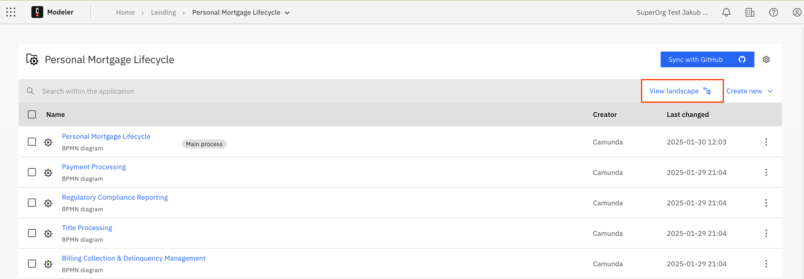
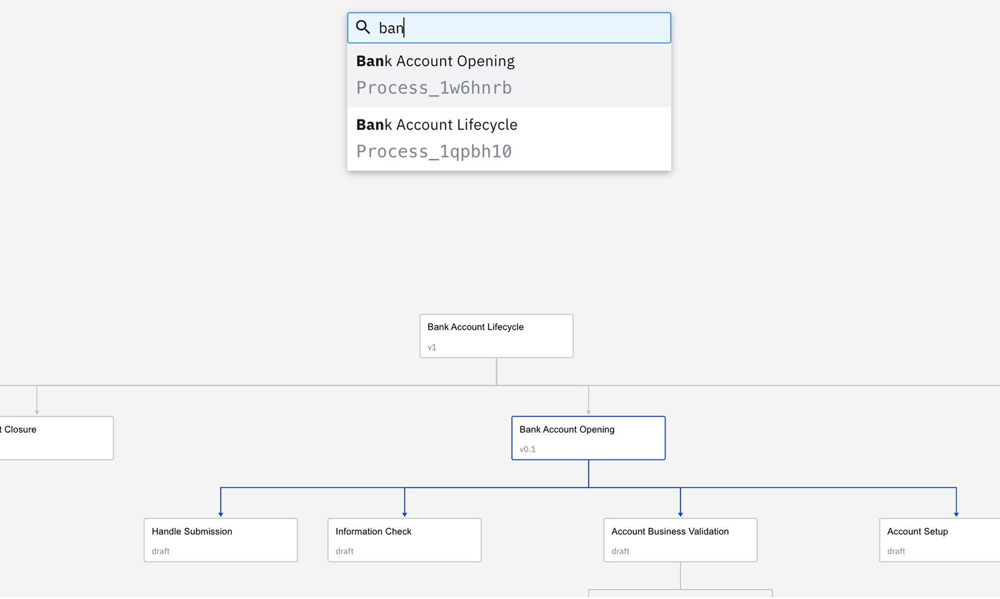

import ProcessLandscapeVisualization from './img/process-landscape-visualization.png';

Camunda 8 only

The process landscape view provides a visual map of all BPMN files within a project and the interfile connections between them.
It helps quickly understand process dependencies, flow relationships, and overall project structure — all in one interactive canvas.

The tool automatically generates a landscape view of all BPMN diagrams within a project, offering insights without the need for manual maintenance or updates.

To access landscape view, follow the steps below:

1. After [creating an account and logging in](/guides/create-account.md) to Camunda, you are automatically taken to Web Modeler. Navigate between the components by clicking the square-shaped **Camunda components** icon in the top left corner of the page.
2. Select **Create new project** to create a new project and store diagrams.
   
3. Add diagrams into the project.
4. Click **Landscape view** button to access the automatically generated project landscape view.
   

## Landscape interaction

1. **Selecting a BPMN File:** Click on any node to see the BPMN file’s information on the sidebar.
   
2. **Searching**: Type the name or identifier of a BPMN file to quickly find and highlight the corresponding node.
   

   :::note
   Results may auto-scroll to the location of the file on the canvas.
   :::

3. **Highlighting Paths:** Clicking on a node or connection will highlight the entire chain of related connections.
   
