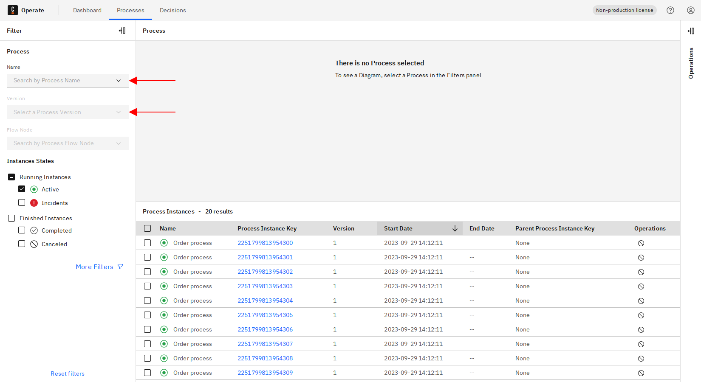
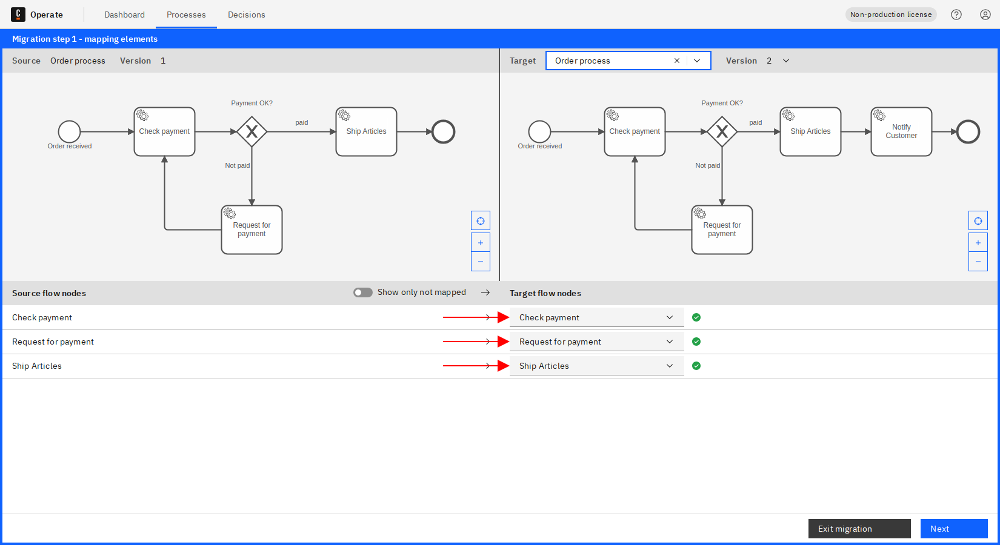
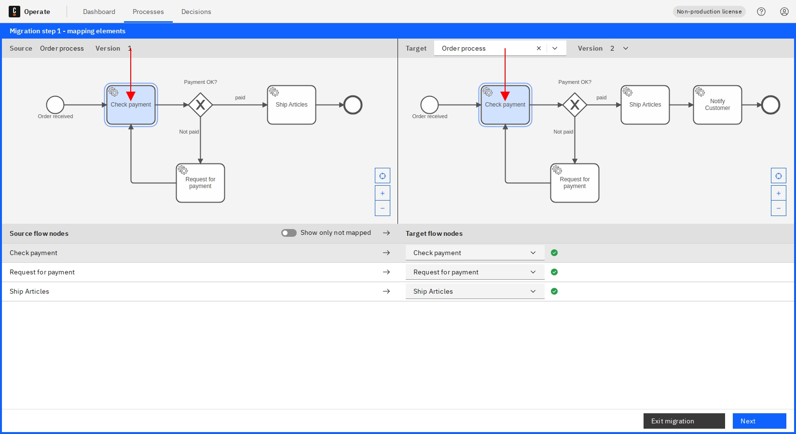

Process instances can be migrated from one specific process definition version to another using the process instance migration feature.

## Process instance selection

1. Select a specific process and version from the filters panel. This will be the source process version where instances is migrated from.

2. Select all instances from the process instances list that should be migrated to another process version. In this example, three instances from `orderProcess` will be migrated.

3. Click **Migrate** to enter migration view.

:::note
It is only possible to migrate running process instances, meaning instances in active or incident state. All other process instances will not be part of the migration plan and will be ignored.
:::

The migration view features three areas: the source process diagram (top left), the target process diagram (top right) and the flow node mapping (bottom panel).

4. Select a target process and version from the dropdown at the top right. This will be the process version where all selected process instances are migrated to.

In the bottom panel, you can see a list of all service tasks from the source process.

5. Use the dropdowns to select a target flow node for each source flow node that should be part of the migration.

In this example, all service tasks from version 1 of `orderProcess` are each mapped to the same service task from version 2 of `orderProcess`.

:::note
It is currently only possible to migrate instances from service tasks to service tasks. To learn about all limitations, visit the [concepts pages](/components/concepts/what-is-camunda-8.md).
:::

1. (Optional) Click on a flow node in the diagram or on a source flow node row in the bottom panel to see how flow nodes are mapped.

In this example, process instances will be migrated from `Check payment` flow node from version 1 of `orderProcess` to the same `Check payment` flow node in version 2 of `orderProcess`.

7. Click **Next** for a preview of the migration plan.

Now, you can see a preview of how flow nodes are mapped and how many process instances are expected to be migrated. In this example, three active instances of the `Check payment` flow node will be migrated from version 1 to version 2 of `orderProcess`.

8. Click **Confirm** to start the migration operation.

## Monitor the migration progress

After the migration operation is started, you are redirected to the instances list view where the migration progress can be monitored in the operations panel:

1. Click the **Instances** link in the operations panel entry to check how many process instances have been migrated to the target process version.

In this example, all three process instances have been successfully migrated to version 2 of `orderProcess`.

If a process instance has not been migrated (due to limitations on the Zeebe side, etc.) it will still show the source process version in the instances list.

