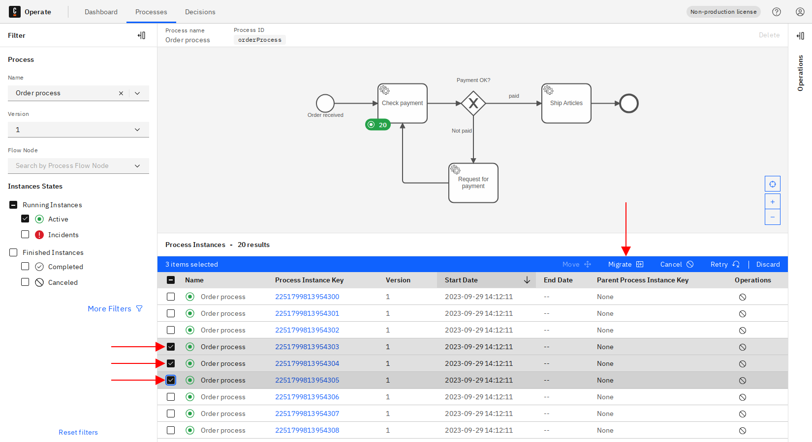
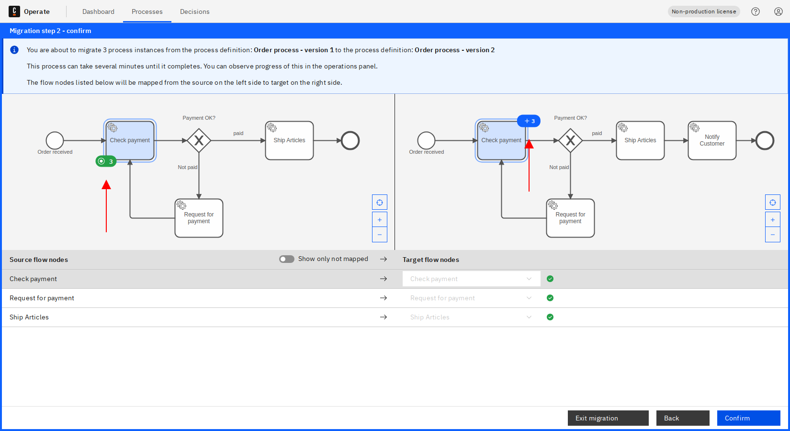

Process instances can be migrated from one specific process definition version to another using the process instance migration feature.

## Process Instance Selection

1. Select a specific process and version from the filters panel. This will be the source process version where instances will be migrated from.

2. Select all instances from the process instances list that should be migrated to another process version. It is possible to select one or more process instances as well as all of them. In this example three instances from Order process will be migrated.

3. Click the Migrate button to enter migration view when all desired instances are selected.

:::note
Please note that it is only possible to migrate running process instances, meaning instances in active or incident state. All other process instances will not be part of the migration plan and will be ignored.
:::

## Migration View

The migration view features three areas: the source process diagram (top left), the target process diagram (top right) and the flow node mapping (bottom panel).

4. Select a target process and version from the dropdown at the top right. This will be the process version where all selected process instances will be migrated to.

In the bottom panel you can see a list of all service tasks from the source process.

5. Use the dropdowns to select a target flow node for each source flow node that should be part of the migration.

In this example all service tasks from version 1 of Order process are each mapped to the same service task from version 2 of Order process.

:::note
Please note that it is currently only possible to migrate instances from service tasks to service tasks. Other flow node types might be supported in the future. To learn about all limitations, please check the [concepts pages](/docs/components/concepts/what-is-camunda-8/) in this documentation.
:::

6. Optional: Click on a flow node in the diagram or on a source flow node row in the bottom panel to see how flow nodes are mapped.

In this example you can see that process instances will be migrated from "Check payment" flow node from version 1 of Order process to the same "Check payment" flow node in version 2 of Order process.

7. Click the "Next" button to see a preview of the migration plan.

In the confirm step of migration view you can see a preview of how flow nodes are mapped as well as how many process instances are expected to be migrated. In this example three active instances of the "Check payment" flow node will be migrated from version 1 to version 2 of Order Process.

8. Click "Confirm" to start the migration operation.

## Monitor the migration progress

After the migration operation was started you will be redirected to the instances list view where the migration progress can be monitored in the operations panel.

9. Click on the "Instances" link in the operations panel entry to check how many process instances have been migrated to the target process version.

In this example all three process instances have been successfully migrated to version 2 of Order process.

In case a process instance has not been migrated (due to limitations on Zeebe side or other reasons) it will still show the source process version in the instances list.

