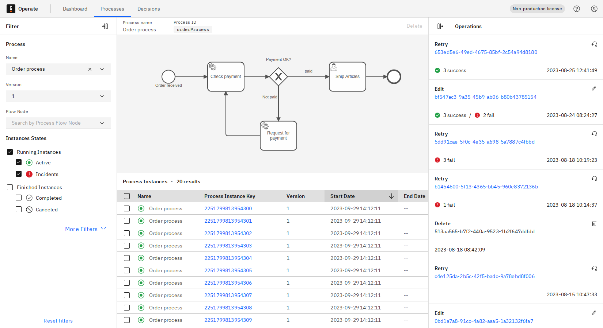

In some cases, you’ll need to retry or cancel many process instances at once. Operate also supports this type of operation.

Imagine a case where many process instances have an incident caused by the same issue. At some point, the underlying problem will have been resolved (for example, maybe a microservice was down for an extended period of time, then was brought back up.)

Though the underlying problem was resolved, the affected process instances are stuck until they are “retried."

Let's create a **selection** in Operate. A selection is a set of process instances on which you can carry out a batch retry or batch cancellation.

To create a selection and apply an operation, take the following steps:

1. Check the box next to the process instances you'd like to include.
2. Select the operation you want to apply.

After confirmation, you can see the **Operations** panel with the current status of all operations.

## Monitor the operation status

Review the [monitor operation status documentation](/components/operate/userguide/monitor-operation-status.png) to learn how to monitor the status of an operation.
