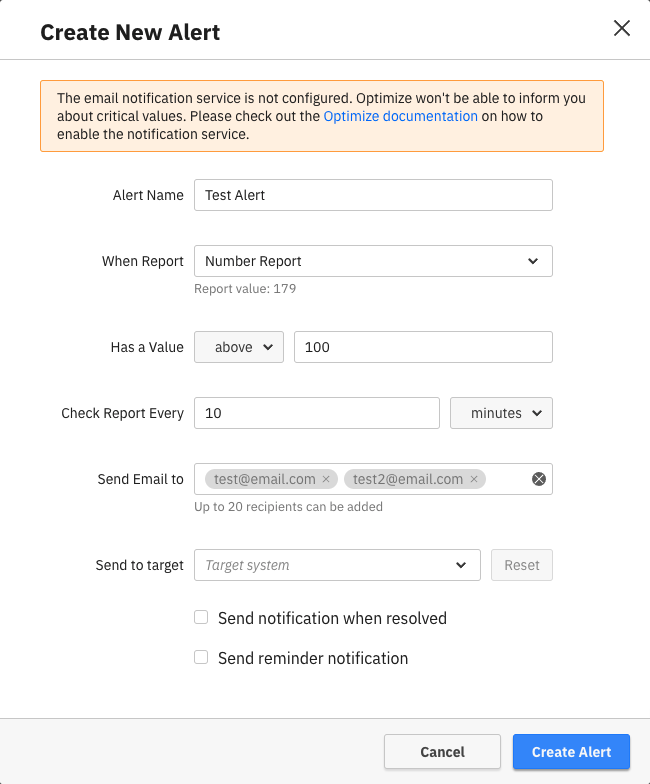

Optimize's alerting functionality can be used to notify you when your report hits a predefined critical value. You can create alerts for any number reports that exist within a collection.

To configure an alert, take the following steps:

1. Inside a collection, navigate to the **Alerts** tab to create and view all alerts defined for reports in this collection. You can manage an alert by moving the mouse over the alert entry and clicking the **Edit** or **Delete** buttons in the context menu on the right side of the page.

2. Click **Create New Alert** to create a new alert. You will then see the following modal:

3. To give the alert a name, select the report and define a target webhook or email address of the person who will receive the alert.

:::note
In Camunda Platform 7 and Camunda Platform 8 Self-Managed, you must configure the email service to receive notifications. See the [technical guide](../../../../self-managed/optimize-deployment/configuration/system-configuration.md#email) for which properties need to be defined.
:::

Note that alerts can only be created for reports which are visualized as a single number and are in the same collection as the alert. Visit the [reports section](../creating-reports.md) on how to define single-number reports.

4. Set a threshold which defines when an alert should be triggered. A notification is sent to the configured email address or webhook as soon as a report value hits the threshold. If reminder notifications are enabled, the alert will continue to send notifications for as long as the value is above (or below, as defined) the threshold.

Finally, you'll get a resolve notification as soon as the report value is within a normal range. For example, say you defined an alert which should be triggered when the report value becomes greater than 50. You also enabled reminder notifications to be sent each hour. Here's what that would look like:

## Send alerts to external systems

It's possible to configure Optimize to send alerts to an external system when needed. For details on how to configure and add target systems, visit the [technical guide](../../../../self-managed/optimize-deployment/configuration/system-configuration.md#alert-notification-webhooks). Once at least one target system is configured, alerts will have a new input option to select one of the configured systems.
