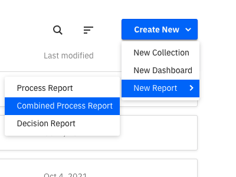
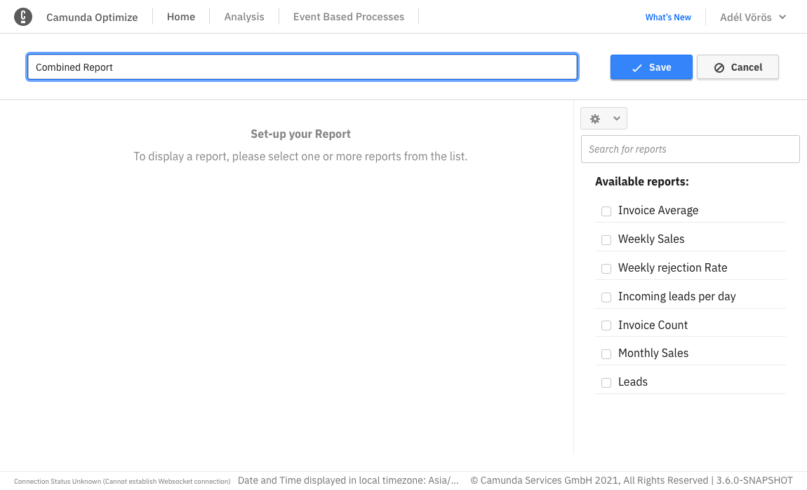

Camunda Platform 7 only

## Creating a combined report

Occasionally, it is necessary to compare multiple reports or visualize them together in one diagram. This can be achieved by creating a special type of report called a **combined report**. To create a new combined report, visit the homepage and click **Create New > New Report > Combined Process Report**.

Then, you are redirected to the combined report builder. There, view the selection panel on the right to select multiple reports to combine.

:::note
If the combined report is inside a collection, only reports in the same collection can be combined. If the combined report is not in a collection, it can only combine reports that are also not in a collection.
:::

A preview of the selected reports will be displayed in the panel on the left.

For example, combining two reports with a table visualization results in the following view:

And combining two reports with line chart visualization results in the following view:

You can change the color of chart reports by clicking on the color box near the name of the report.

You can also drag items in the list of selected reports to change their order in the report view.

:::note
Not all reports can be combined with each other given differences in their configurations, e.g. a different visualization, may make them incompatible. Therefore, when selecting a report, only the other reports that are combinable with the selected one will appear.
:::

Only reports that match the following criteria can be combined:

- Same group by
- Same visualization
- Same view but combining user task duration (work, idle, and total). Flow node duration reports are also possible.
- Distributed reports cannot be combined
- Multi-measure reports including reports containing multiple aggregations or multiple user task duration times cannot be combined.
- Process definition can be different.
- Furthermore, it is possible to combine reports grouped by start date with reports grouped by end date under the condition that the date interval is the same.

Moreover, only the following visualizations are possible to combine and will show up in the combined selection list:

- Bar chart
- Line chart
- Table
- Number

Currently, it is not possible to combine decision reports.

It is also possible to update the name of the report, save it, and add it to a dashboard exactly like the normal report. The combined reports will also show up in the reports list along with the normal reports.

### Configure combined reports

You can configure the combined report using the cog wheel button available on the top right side of the screen.

For example, in all chart reports, you can change what to show in the tooltips, change the axis names, and set a goal line as shown in the figure below.

