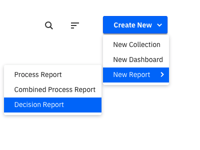
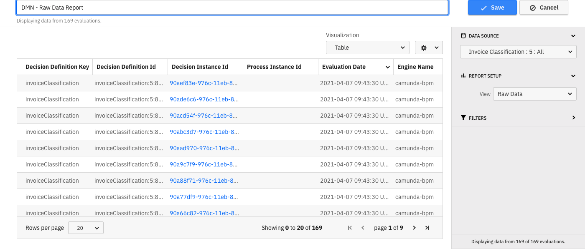
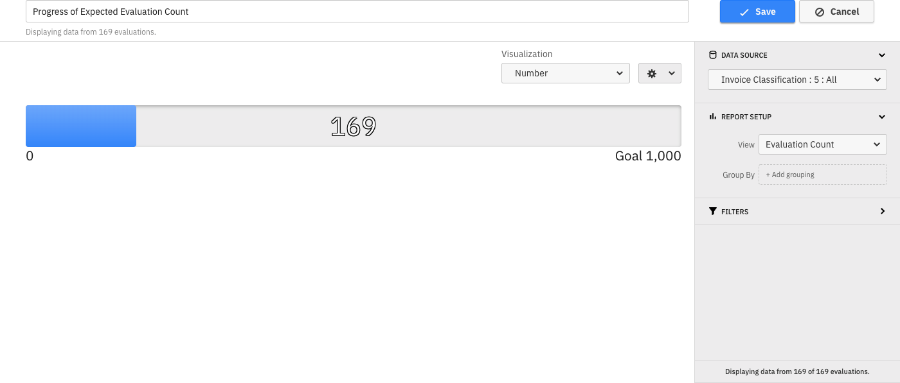
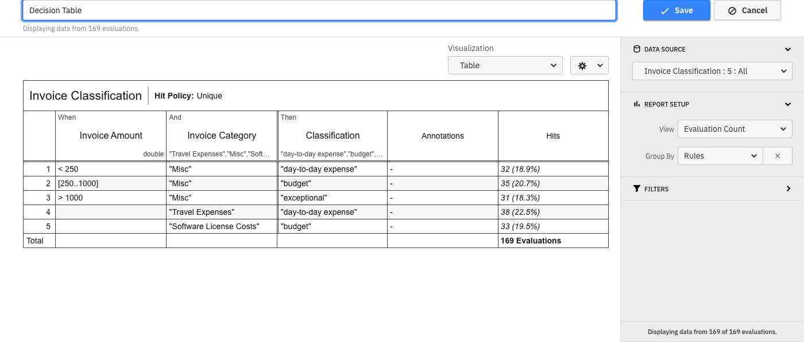
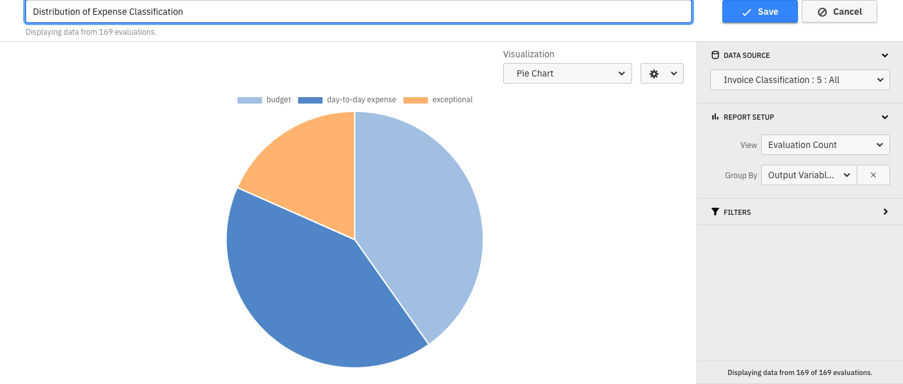

Camunda Platform 7 only

Decision reports are very similar to process reports, but allow you to gain insights in your decision definitions, rather than process definitions.

To create a decision report, click on the **Decision Report** option using the **Create New** dropdown button available on the homepage.

There are a number of different reports you can create based on decisions:

## Raw data

Similar to the raw data process report, this allows you to view a table listing all available decision data. This can come in handy if you found interesting insights in certain decision evaluations and need detailed information about those evaluations, or you are exploring a decision definition with a limited number of evaluations.

You can reorder the columns and click on any column header to sort the table by this column. Using the configuration dialog, you can also define which columns to show and whether to include the evaluation count number in the report. These settings are only available in the edit mode of the report.

To create a raw data report, select **Raw Data** from the view dropdown. The other fields are filled automatically.

## Evaluation count

This view option allows you to create reports that show how often the decision was evaluated. Depending on the group by selection, this could be either the total number of evaluations, a chart displaying how this number of evaluations developed over time, or how they were distributed across variables or rules. As always, you can define [filters](../additional-features/filters.md) to specify which decision evaluations to include in the report.

#### Group by: None

This shows a single number indicating the total amount of evaluations for this decision definition and version in the current filter. Using the configuration dialog, you can limit the precision of the number and define a goal to create a progress bar. Details of both options are described in the [process report configuration section](../creating-reports.md#number).

#### Group by: Rules

This report shows the decision table with an additional column to the right. This column contains information on how often each rule matched an evaluation. It also shows a bar indicating how frequently a single rule was matched. You can turn off the numbers or the bar in the configuration dialog.

#### Group by: Evaluation date

Using this group by option allows you to see the development of evaluations over time. The result can be visualized as table or chart. In combination with filters, this allows you to create powerful reports. For example, to show during which time period the decision resulted in a certain output variable. If you visualize such a report as a chart, you have access to all the [chart visualization options](../creating-reports.md#charts-line-bar-pie) process reports have, too.

#### Group by: Input or output variable

This option allows you to choose a variable from the decision definition to group the results by. In the report, you will see which values this variable had over all evaluations in the filter and how often each value was encountered when evaluating the decision. This type of report can be visualized as table or chart.

