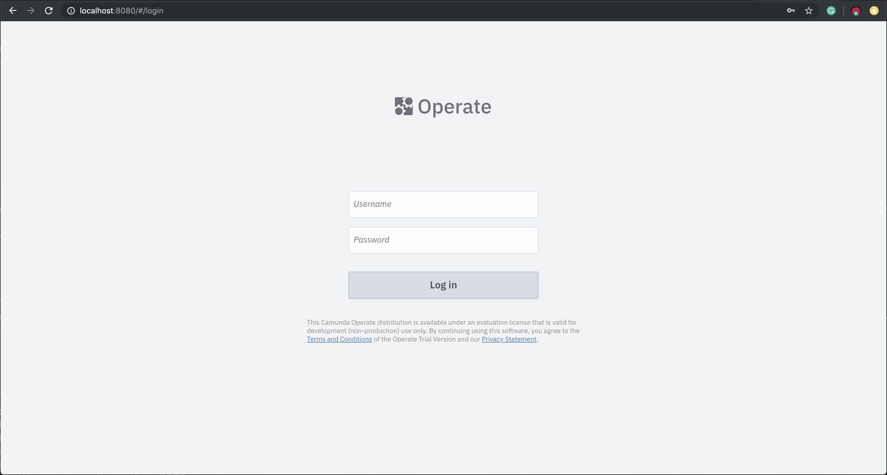
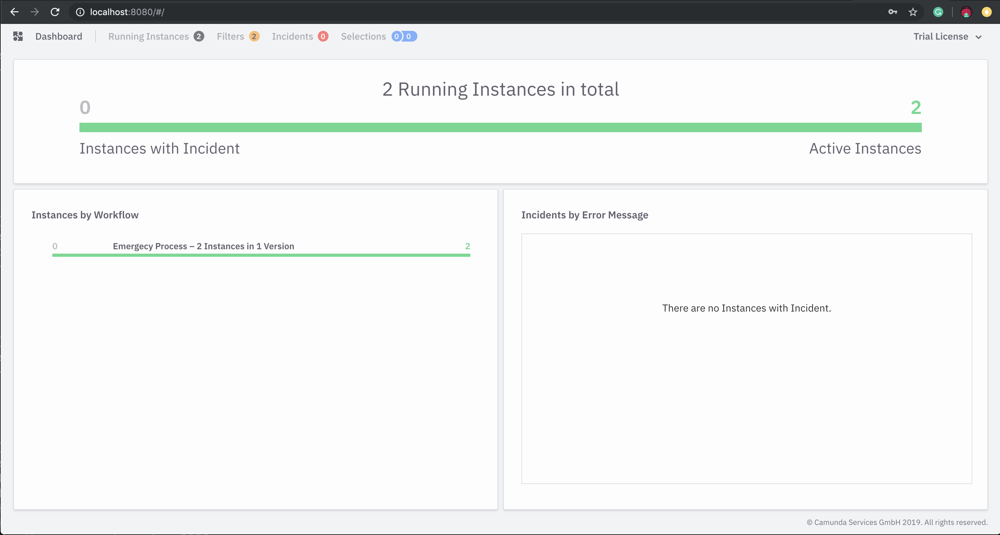

The **Zeebe Full Helm charts** install an ingress controller. If this is deployed in a cloud provider (GKE, EKS, AKS, etc.), it should provision a `LoadBalancer` which will expose an external IP that can be used as the main entry point to access all the services/applications that are configured to have Ingress Routes.

> If you have your own ingress controller, you can use the child chart to install a Zeebe cluster, instead of using the parent chart.

You can find the external IP by running the following:

```
> kubectl get svc
```

You should see something like the following:

```
NAME                                    TYPE           CLUSTER-IP       EXTERNAL-IP   PORT(S)                                  AGE
<RELEASE NAME>-nginx-ingress-controller        LoadBalancer   10.109.108.4     <pending>     80:30497/TCP,443:32232/TCP               63m
```

The `<pending>` under the `EXTERNAL-IP` column should change to a public IP that you (and other users) should be able to access from outside the cluster. Check your cloud provider's specific configuration if that doesn't work.

Then, you should be able to access Operate pointing your browser at `http://<EXTERNAL-IP>`.

If you are running in Kubernetes KIND, you will need to `port-forward` to the ingress controller main entry point due KIND doesn't support LoadBalancers. You can do that by running in a different terminal:

```
> kubectl port-forward svc/<RELEASE NAME>-nginx-ingress-controller 8080:80
```

Then, you should be able to access Operate pointing your browser at [http://localhost:8080](http://localhost:8080/).



Using `demo`/`demo` for credentials.



If you deploy process definitions, they will appear in the dashboard and then you can drill down to see your active instances. You can deploy and create new instances using the Zeebe clients or `zbctl`.
