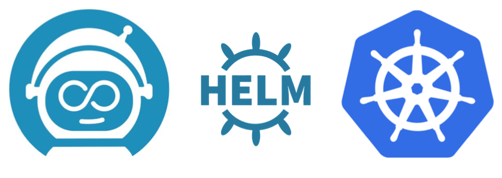

This section covers the fundamentals of running Zeebe in Kubernetes.

There are several alternatives to deploy applications to a Kubernetes cluster, but the following sections use Helm charts to deploy a set of components into your cluster.

Helm allows you to choose exactly what chart (set of components) you want to install and how these components need to be configured. These Helm charts are continuously being improved and released to the [Zeebe Helm Chart Repository](http://helm.camunda.io).

:::note
All Helm charts are provided as a community effort. These charts are not part of the Zeebe or Camunda Cloud release process. Therefore, these charts are not updated as regularly as other artifacts. You are encouraged to get involved, submit fixes, and report issues if you find them.
:::

You are free to choose your Kubernetes provider, our Helm charts are not cloud provider-specific. We encourage [reporting issues](http://github.com/camunda-community-hub/zeebe-full-helm/issues) if you find them.

You can also join us on [Slack](https://camunda-cloud.slack.com/).

This chapter is divided into the following sections:

- [Prerequisites](prerequisites.md)
- [Getting to know and installing Zeebe Helm charts](installing-helm.md)
- [Accessing Operate from outside our Kubernetes cluster](accessing-operate.md)
