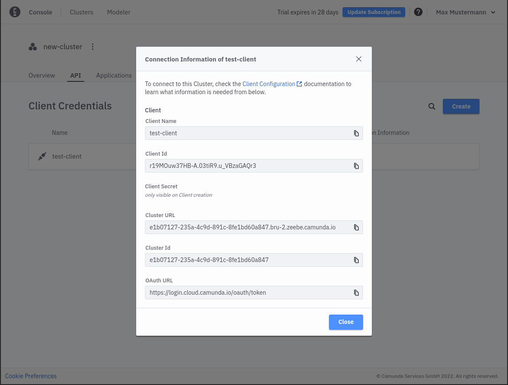

<span class="badge badge--beginner">Beginner</span>
<span class="badge badge--short">Time estimate: 5 minutes</span>

## Prerequisites

- Web Modeler or [Desktop Modeler](https://camunda.com/download/modeler/)

:::note

BPMN diagrams must be created for the process engine they intend to be deployed on. You cannot currently run a BPMN diagram modeled for Camunda Platform 7 in Camunda Cloud, or vice versa.
:::

## Deploy and start your process instance

import Tabs from "@theme/Tabs";
import TabItem from "@theme/TabItem";

<Tabs groupId="modeler" defaultValue="console" values={
[
{label: 'Web Modeler', value: 'console', },
{label: 'Desktop Modeler', value: 'desktop', },
]
}>

<TabItem value='console'>

You can click the blue **Deploy Diagram** button to deploy the newly-created process to your cluster.


Deployment can take a few seconds, but you should get a confirmation for successful deployment.


You can now start a new process instance. For this example, you can start an instance with an empty payload.


Once the instance is started, you'll receive a confirmation with a link to open Operate.


</TabItem>

<TabItem value='desktop'>

Take the following steps:

1. On the right side of the navigation menu, note the buttons for deploying and starting processes.


2. In the deployment dialog, the connection information must now be specified: `Cluster Id`, `Client Id`, and `Client Secret`.

`Client Id` and `Cluster Id` can be retrieved by clicking on **View** on the client in the **API** tab.



The `Client Secret` can be retrieved from the downloaded connection file:

```bash
grep SECRET  ~/Downloads/CamundaCloudMgmtAPI-Client-test-client.txt
export ZEEBE_CLIENT_SECRET='zbzsZI_6UnCsH_CIo0lNUN8qGyvLJr9VrH77ewNm8Oq3elvhPvV7g.QmJGydzOLo'
```

3. Click **Deploy** to deploy the process. Use **Play** from the navigation to start a new instance.

</TabItem>
</Tabs>

## Next steps

- [Implement a service task](implement-service-task.md)
- [Setting up your first development project](./../setting-up-development-project.md)