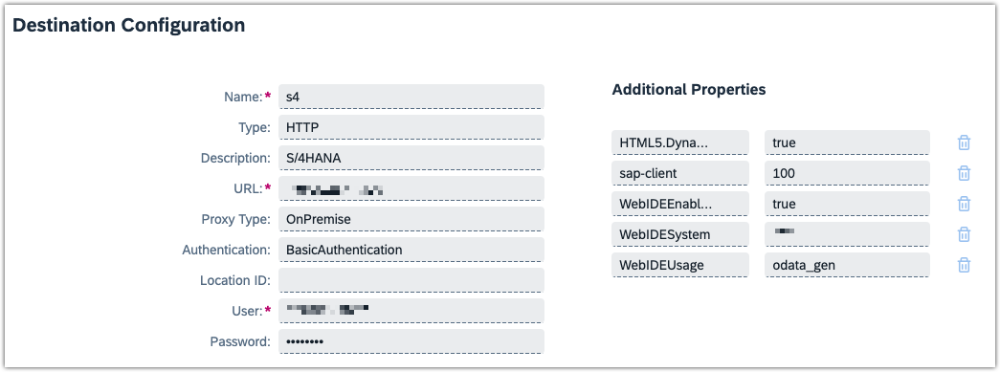
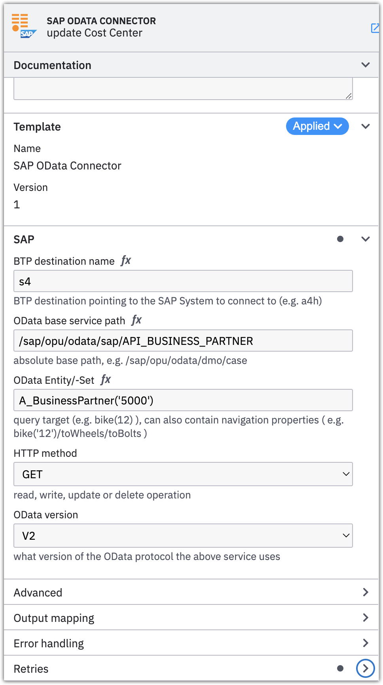
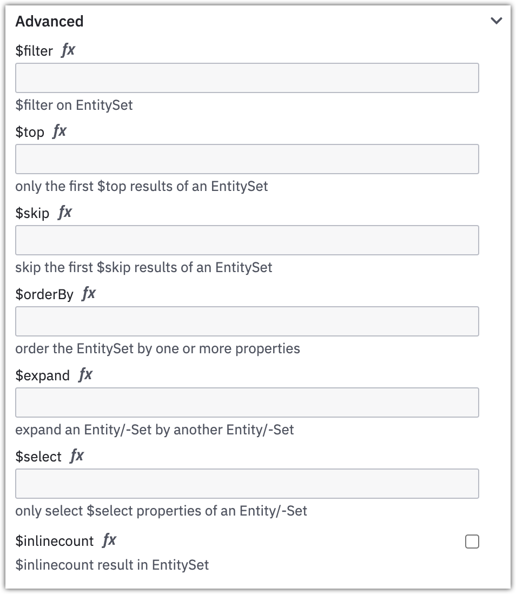
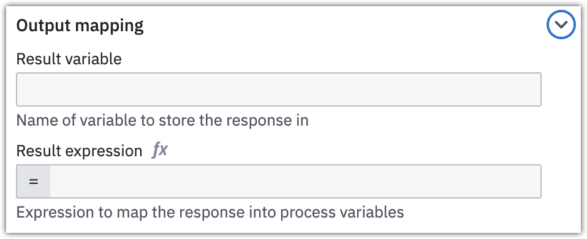
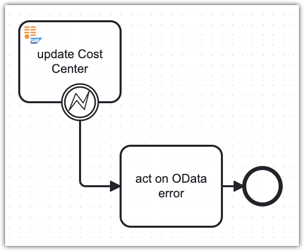

The SAP OData Connector is a protocol and outbound [Connector](/components/connectors/introduction.md) that runs as a Docker image on the SAP Business Technology Platform (BTP).

This Connector is designed to run in [hybrid mode](/guides/use-connectors-in-hybrid-mode.md), hosted in the customer's SAP BTP sub-account in the [Cloud Foundry environment](https://discovery-center.cloud.sap/serviceCatalog/cloud-foundry-runtime?region=all).

This Connector works with Camunda 8 SaaS, and utilizes SAP BTP's [Destination](https://learning.sap.com/learning-journeys/administrating-sap-business-technology-platform/using-destinations) and [Connectivity](https://help.sap.com/docs/connectivity/sap-btp-connectivity-cf/what-is-sap-btp-connectivity) concepts to query a SAP system via both OData v2 and v4.

:::note Important!
This Connector is an alpha feature and available upon request. Visit [https://camunda.com/contact](https://camunda.com/contact) to contact us.
:::

## Overview

For a standard overview of the steps involved in the SAP OData Connector, examine the diagram below:


## Prerequisites

To run the SAP OData Connector Docker image, the following SAP infrastructure setup is required:

- [Cloud Foundry CLI](https://github.com/cloudfoundry/cli) with [multiapps plugin](https://github.com/cloudfoundry/multiapps-cli-plugin) installed on the machine executing the deployment.
- SAP BTP subaccount with a [Cloud Foundry environment](https://discovery-center.cloud.sap/serviceCatalog/cloud-foundry-runtime?region=all) enabled and a [created space](https://help.sap.com/docs/btp/sap-business-technology-platform/create-spaces).
- Minimum of [1 GB storage quota and 2 GB runtime memory](https://help.sap.com/docs/btp/sap-business-technology-platform/managing-space-quota-plans).
- [Entitlements](https://help.sap.com/docs/btp/sap-business-technology-platform/managing-entitlements-and-quotas-using-cockpit) for:
  - [Connectivity Service](https://discovery-center.cloud.sap/serviceCatalog/connectivity-service?region=all), `lite` plan (to connect to the SAP is on-premises).
  - [Destination Service](https://discovery-center.cloud.sap/serviceCatalog/destination?service_plan=lite&region=all&commercialModel=btpea), `lite` plan.
- One or more instance- or subaccount-level destinations, pointing to the SAP systems to communicate with.
  
- Ensure `Additional Properties` are correctly set on the Destination. For example:

```json
HTML5.DynamicDestination: true
sap-client: <client/"Mandant" to work with on the SAP system>
WebIDEEnabled: true
WebIDESystem: <SAP system ID>
WebIDEUsage: odata_gen
```

:::warning
Currently, only `BasicAuthentication` is supported on the Destination by the SAP OData Connector.
:::

## Deployment to BTP

A descriptor file is required to deploy the SAP OData Connector to a space in a SAP BTP subaccount. An exemplary deployment descriptor `mtad.yaml.example` is provided by Camunda. This is a standard format in SAP BTP's Cloud Foundry environment to describe the application that needs deployment. Take the following steps:

1. Adjust the values to match those of the targeted Camunda 8 SaaS environment and rename it to `mtad.yaml`.
2. Adjust the names of the SAP BTP Destination and Connectivity instances to your liking - both will be created automatically for you upon deployment. If instances in your subaccount of any of the two services exist, they will be reused.
3. After creating the `mtad.yaml` file, log into the desired SAP BTP subaccount via the [Cloud Foundry `cli`](https://github.com/cloudfoundry/cli) (cf-cli):

```shell
$> cf login
API endpoint: https://api.cf. ...
...
```

4. Deploy the SAP OData Connector via the `cf-cli`. Note that this requires [the "multiapps" plugin of Cloud Foundry](https://github.com/cloudfoundry/multiapps-cli-plugin) to be installed on the machine the deployment runs on:

```shell
$> cf deploy ./ # append the -f flag to shortcircuit ongoing deployments
Deploying multi-target app archive /Some/path/sap-odata-connector.mtar in org <your-org> / space <your-space> as you@example.org ..
...
Application "sap-odata-connector" started and available at "some.url.hana.ondemand.com"
```

## Deployment in Camunda 8 SaaS

- If using Web Modeler, [import the SAP OData Connector's element template](/components/connectors/manage-connector-templates.md#importing-existing-connector-templates) for design use.


- If using Desktop Modeler, [follow the standard importing procedure](/components/modeler/desktop-modeler/element-templates/configuring-templates.md).

## Working with the SAP OData Connector in Camunda Modeler

### Modeling options

To use the **SAP OData Connector** in your process, either change the type of existing task by clicking on it and using the **wrench-shaped** change type context menu icon, or create a new Connector task by using the **Append Connector** context menu. Follow our [guide to using Connectors](/components/connectors/use-connectors/index.md) to learn more.

:::note
The configuration options will dynamically change with the selected HTTP method and the OData protocol version. For example, a `payload` field is only displayed when the HTTP method is something other than "GET".
:::



Specifying the `BTP destination name` allows you to reuse existing Destinations from the subaccount or instance level. Authentication and authorizations are maintained at this level, which is why it's not necessary to maintain credentials for the Connector.

### Advanced capabilities

In addition to the basic OData settings such as Service, Entity, EntitySet, Method, and OData version, the **Advanced** section allows you to fine tune `GET` queries to the SAP method with all standard parameters.

For example, supplying `$filter` and `$select` parameters help in reducing data transferred over the wire, while `$expand` helps in retrieving additional entities with a single query.



### Query result structure

The result of any query, be it reading or writing to the SAP system, is in JSON format and holds the following structure:

```json
{
  result: <further json>,
  statusCode: <http status code>,
  countOrInlineCount: <integer, optional!>
}
```

- `result` contains the result of the query, whether it is content retrieved from a SAP system via `GET` or the result of a write or update operation via `POST`, `PUT`, `PATCH`, or `DELETE`. (Note that with the latter, the `result` is always empty.)
- `statusCode` holds the [HTTP status code](https://developer.mozilla.org/en-US/docs/Web/HTTP/Status) of the operation.
- `countOrInlineCount` is only present in the response when the corresponding option `$inlinecount` (for OData v2) or `$count` (for OData v4) was checked in the design time of the BPMN task. It then shows the number of results from the `GET` query to the SAP system.



The query result can either be mapped to a single result variable or worked on [via FEEL with an expression](/components/connectors/use-connectors.md#result-expression). The same is applicable to `getResponse`, as a result variable contains the described query JSON in its entirety. The result expression `{getStatusCode: statusCode}` would only hold the HTTP status code in the `getStatusCode` process variable.

### Error handling

The SAP OData Connector allows handling of query errors directly in the model. This means an OData error is relayed to the process instance in the reserved variables `bpmnError` and `error` and can be processed accordingly.

1. Equip the Connector task with an error handling expression such as:

```js
if error.code = "400" then
  bpmnError("400", "client request is bad", { errorMessage: error.message, errorCode: error.code })
else if error.code = "404" then
  bpmnError("404", "queried resource not found", { errorMessage: error.message, errorCode: error.code })
else if error.code = "500" then
  bpmnError("500", "server error", { errorMessage: error.message, errorCode: error.code })
else if error.code = "503" then
  bpmnError("503", "I'm just an proxy teapot", { errorMessage: error.message, errorCode: error.code })
else
  null
```


2. Specifically note the third parameter to `bpmnError`:

```js
{ errorMessage: error.message, errorCode: error.code }
```

This relays the error message and code to the next step in the process flow.

3. Equip the BPMN task with an error boundary event:



If the SAP OData Connector encounters an error, the boundary event will catch the error and continue the process flow. The error boundary event can receive these configuration parameters to contain further error details:


- `errorMessage`: Contains a verbose version of the error message and cause and relays it into the process scope as `ov_errorMessage`.
- `errorCode`: Holds a predefined value describing the scope of the error, relaying it to the process scope as `errorCode`. It can be one of the following:
  - `INVALID_PAYLOAD`: The payload of the request was detected as erroneous by the server.
  - `REQUEST_ERROR`: The request contained an error, for example, a wrong combination of `GET` query parameters.
  - `GENERIC_ERROR`
  - `DESTINATION_ERROR`: An error occurred while claiming the Destination from the runtime environment.
- `error`: The serialized Error object, available in the example above as `ov_error`.

## Tips

- Ensure the connection from the Cloud Foundry environment via the destination to the SAP systems works. Using the [Terminal in Business Application Studio](https://community.sap.com/t5/technology-blogs-by-sap/how-to-check-the-connectivity-to-your-backend-system-in-business/ba-p/13479832) is a quick way to verify this.
- Validate requests first in an API client before trying with the SAP OData Connector in Modeler. Then, copy over to the element template fields. This saves time and reduces potential error.
- Any payload size <= 2.5MB can be considered safe.
