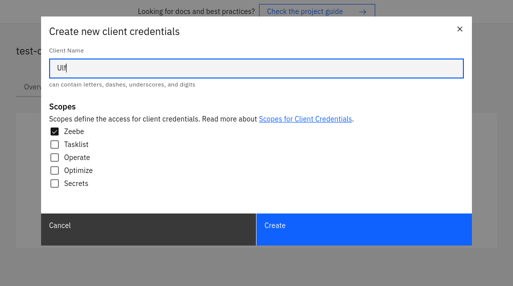
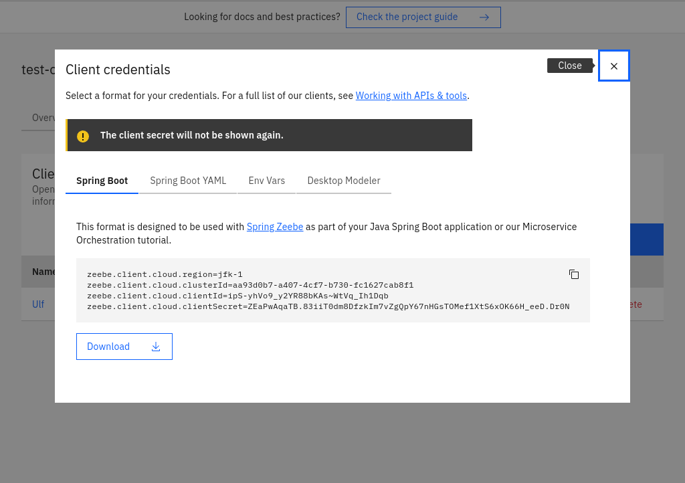

Beginner
Time estimate: Under 5 minutes

Here, we'll set up client connection credentials to create, name, and connect your client.

## Create a client

Currently, Camunda 8 SaaS supports the following scopes:

- Zeebe - Access to the [Zeebe gRPC](/apis-tools/zeebe-api/grpc.md) and [REST](/apis-tools/zeebe-api-rest/zeebe-api-rest-overview.md) APIs.
- Tasklist - Access to the Tasklist GraphQL API.
- Operate - Access to the [Operate REST API](/apis-tools/operate-api/overview.md).
- Optimize - Access to the [Optimize REST API]($optimize$/apis-tools/optimize-api/overview).
- Secrets - Access cluster secrets in a [hybrid setup](/guides/use-connectors-in-hybrid-mode.md).

To create a new client, take the following steps:

1. Navigate to the API tab [in Camunda Console](https://console.cloud.camunda.io/) by clicking **Clusters > Cluster name > API**.
   
2. Click **Create your first client** to create a new client and name your client accordingly.
3. Determine the scoped access for client credentials. Select **Zeebe client** so the newly-created client can access your Zeebe instance.
   
4. Make sure you keep the generated client credentials in a safe place. The **Client secret** will not be shown again. For your convenience, you can also download the client information to your computer.

The downloaded file contains all the necessary information to communicate with your Camunda 8 instance in the future:

- `ZEEBE_ADDRESS`: Address where your cluster can be reached.
- `ZEEBE_CLIENT_ID` and `ZEEBE_CLIENT_SECRET`: Credentials to request a new access token.
- `ZEEBE_AUTHORIZATION_SERVER_URL`: A new token can be requested at this address using the credentials.
- `ZEEBE_TOKEN_AUDIENCE`: The audience for a Zeebe token request.
- `CAMUNDA_CLUSTER_ID`: The UUID of the cluster.
- `CAMUNDA_CLUSTER_REGION`: The region of the cluster.
- `CAMUNDA_CREDENTIALS_SCOPES`: A comma-separated list of the scopes this credential set is valid for.
- `CAMUNDA_OAUTH_URL`: A new token can be requested at this address using the credentials. Duplicates the earlier Zeebe-focused variable.

Depending on the scopes granted to these client credentials, the following variables may also be present:

- `CAMUNDA_TASKLIST_BASE_URL`: The base URL for the Tasklist API.
- `CAMUNDA_OPTIMIZE_BASE_URL`: The base URL for the Optimize API.
- `CAMUNDA_OPERATE_BASE_URL`: The base URL for the Operate API.
