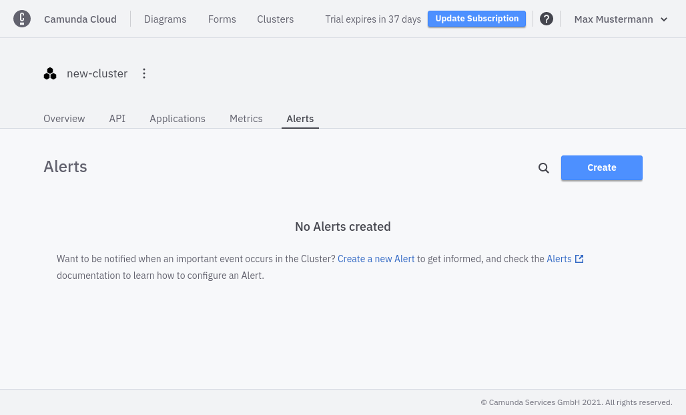
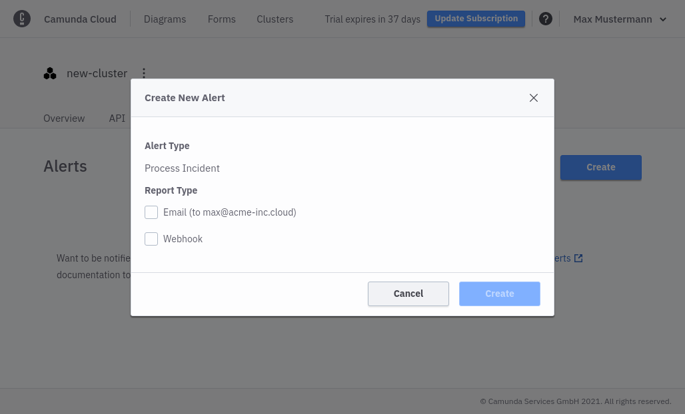
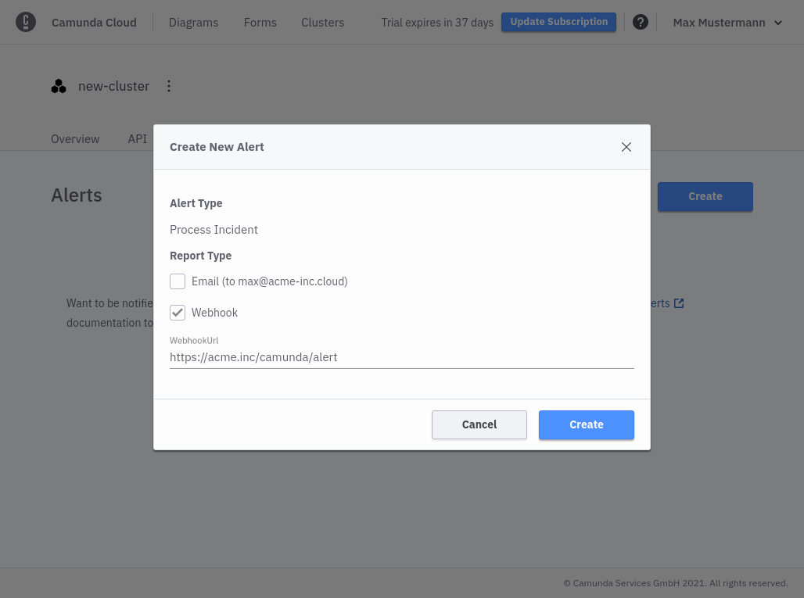

Camunda Cloud allows you to get notified when Process Instances stop with an error.

There are two types of reporting,

- By mail to the email address of your user accounts
- By webhook

### Create an alert

To create a new alert you have to navigate into the `Alert` tab:



Click **Create** to create a new alert.



You can choose between `Email` and `Webhook`. For `Email` no further information is needed.
To create a `Webhook` alert, you need to provide a valid webhook url that excepts `POST` requests.



You can only have one `Email` alert per Cluster but you can create multiple `Webhook` alerts if needed.

### Webhook alerts

Webhook alerts contain a JSON body with following structure:

```json
{
    "clusterName": "cluster-name",
    "clusterId": "88d32bfc-4f8e-4dd3-9ae2-adfee281e223",
    "operateBaseUrl": "https://console.cloud.camunda.io/org/2b3bc239-ad5b-4eef-80e0-6ef5139ed66a/cluster/88d32bfc-4f8e-4dd3-9ae2-adfee281e223/operate",
    "clusterUrl": "https://console.cloud.camunda.io/org/2b3bc239-ad5b-4eef-80e0-6ef5139ed66a/cluster/88d32bfc-4f8e-4dd3-9ae2-adfee281e223",
    "alerts": [
        {
            "operateUrl": "https://console.cloud.camunda.io/org/2b3bc239-ad5b-4eef-80e0-6ef5139ed66a/cluster/88d32bfc-4f8e-4dd3-9ae2-adfee281e223/operate/#/instances/2251799829404548",
            "processInstanceId": "1234567890123456",
            "errorMessage": "something went wrong",
            "errorType": "JOB_NO_RETRIES",
            "flowNodeId": "node-id",
            "jobKey": 1234567890123456,
            "creationTime": "2021-07-22T08:00:00.000+0000",
            "processName": "process-name",
            "processVersion": 1
        }
    ]
}
```
