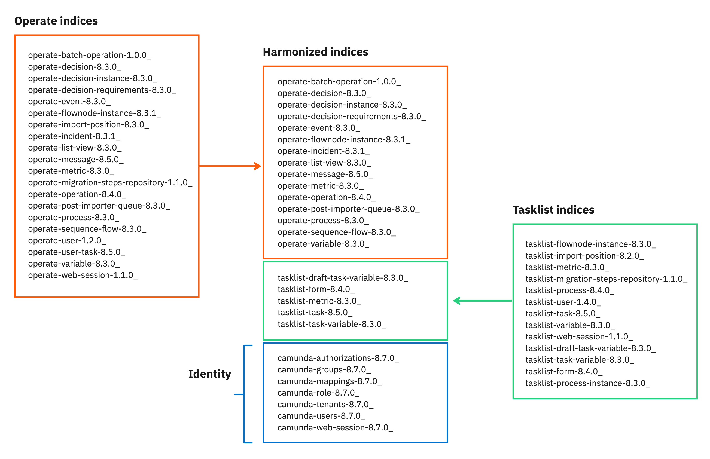
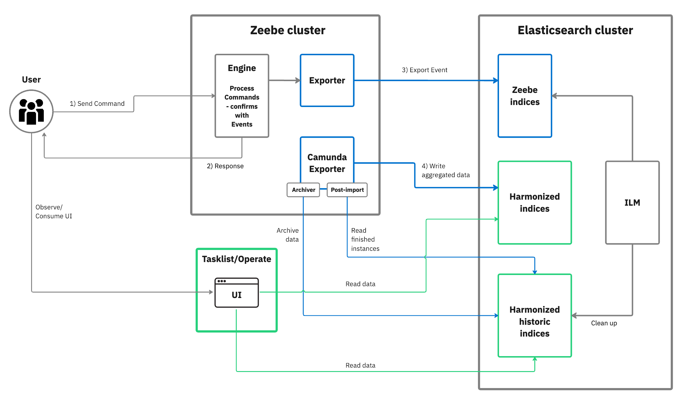

Important changes and updates for the Camunda 8.7 release are summarized below.

| Scheduled release date | Scheduled end of maintenance | Release notes                                        | Blog                                                                                            |
| :--------------------- | :--------------------------- | :--------------------------------------------------- | :---------------------------------------------------------------------------------------------- |
| 11 February 2025       | 11 August 2026               | [8.7 release notes](/reference/release-notes/870.md) | [Announcing Camunda 8.7](https://camunda.com/blog/2024/11/camunda-8-7-releasing-february-2025/) |

- [API updates](#api-updates-saasself-managed)
- [Identity management updates](#identity-management-updates-saasself-managed)
- [Installation and deployment updates](#installation-and-deployment-updates-self-managed)
- [Camunda Java client and Camunda Spring SDK](#camunda-java-client-and-camunda-spring-sdk-self-managed)

## API updates <span class="badge badge--long" title="This feature affects SaaS">SaaS</span><span class="badge badge--long" title="This feature affects Self-Managed">Self-Managed</span>

The 8.7 release includes API updates to support the move to a [Camunda 8 REST API](/apis-tools/camunda-api-rest/camunda-api-rest-overview.md) unified experience.

### Camunda 8 REST API updates

- New Query endpoints (with advanced search filtering) will be added for process entities (processes, decisions, user tasks, and forms). These will replace the component APIs (Tasklist, Operate) going forward.
- New endpoints will allow you to manage and query users and resource permissions in an orchestration cluster.
- All the Camunda 8 REST API endpoints will support resource-based authorizations to enable fine-grained permissions.
- API terminology is aligned so technical assets have an identical, easily-understood, descriptive property name.

### Deprecated: Operate and Tasklist v1 REST APIs

The deprecation process for the [Operate](/apis-tools/operate-api/overview.md) and [Tasklist](/apis-tools/tasklist-api-rest/tasklist-api-rest-overview.md) REST APIs starts with the 8.7 release. You can begin migrating to the [Camunda 8 REST API](/apis-tools/camunda-api-rest/camunda-api-rest-overview.md) for querying to prepare for this change.

- Version 8.7, 8.8: These APIs are still available but deprecated, and so not recommended for new implementations.
- Version 8.9: These APIs will be removed.

### Deprecated: Job-based user tasks querying

As **job-worker** user tasks will be deprecated with Camunda 8.9, Camunda recommends using **Camunda user tasks** (formerly known as **Zeebe user tasks**) in your process definitions. Note that you may still see references of **Zeebe user tasks** in your XML, but this is the same thing as Camunda user tasks.

- Version 8.7, 8.8: **job-worker** user tasks are available for querying, but Camunda Modeler automatically applies the **Camunda user task** and shows a warning message for each job worker user task.
- Version 8.9: **job-worker** user tasks will be deprecated. With Camunda 8.9+, customers can use the **job-worker** implementation of user tasks as standard jobs with headers to enable open architecture and composable solutions.

### Deprecated: Zeebe gRPC API endpoints

With the 8.7 release, Camunda announces the deprecation of several [Zeebe gRPC](/apis-tools/zeebe-api/grpc.md) endpoints for removal in 8.9.

- Key gRPC endpoints necessary for high-throughput and low-latency applications remain available with 8.7.
- The final list of retained gRPC endpoints will be confirmed with the 8.7 release.
- Selected endpoints will remain active, with others scheduled for removal in the 8.9 release.

### Removed: Tasklist GraphQL API

With the 8.7 release, the deprecated [Tasklist GraphQL API](/apis-tools/tasklist-api/tasklist-api-overview.md) will be removed from the product.

<!-- :::info
Learn more about these updates in Upcoming API Changes in Camunda 8.
::: -->

## Identity management updates <span class="badge badge--long" title="This feature affects SaaS">SaaS</span><span class="badge badge--long" title="This feature affects Self-Managed">Self-Managed</span>

The [Identity service](/self-managed/identity/what-is-identity.md) is enhanced to deliver greater flexibility, control, and security for both Self-Managed and SaaS users. These updates are part of our broader effort to streamline the platform’s architecture.

### Cluster-level identity management

Identity settings will be configured at the orchestration cluster level, allowing each cluster to have unique OIDC configurations. This cluster-specific setup empowers organizations to assign different identity providers (IdPs) across clusters, offering improved control over permissions and user group mappings, resulting in a more streamlined and efficient configuration experience.

For SaaS customers, identity management in Camunda 8.7 remains consistent with Camunda 8.6, allowing the attachment of a single IdP per organization. However, cluster-level identity capabilities are provided for SaaS as well as Self-Managed. This means that user groups, roles, and access permissions can now be managed at the cluster level, giving SaaS customers the same granular access control as in Self-Managed environments.

### Decoupling from Keycloak <span class="badge badge--long" title="This feature affects Self-Managed">Self-Managed</span>

Built-in Keycloak integration in Self-Managed is removed, allowing customers to use any compatible IdP.

- Keycloak remains fully supported as an external option. For cluster-level identity management it must be connected as an external OIDC provider moving forward.
- OpenID Connect (OIDC) remains the standard for seamless integration with chosen IdPs.

### Resource-based permissions

Resource-level permissions are introduced for process definitions and web applications.

- Admin users retain full access, but regular users must be granted specific permissions to perform actions/view resources.
- For organizations that build custom front-ends and access Camunda via API, users with API permissions can still access process data through the V2 API.

<!-- :::info
Learn more about these updates in Introducing Enhanced Identity Management in Camunda 8.7.
::: -->

## Installation and deployment updates <span class="badge badge--long" title="This feature affects Self-Managed">Self-Managed</span>

Camunda 8.7 introduces a streamlined architecture, consolidating core components such as Zeebe, Operate, and Tasklist into a single deployable unit. Enhanced deployment options are also included, such as new Kubernetes Helm guides, deployment reference architectures, and improved support for professional developers with Camunda 8 Run.

You can download the alpha release of the unified package from the Camunda GitHub repository, either as an executable Java application (Camunda Orchestration Core) or a Docker image.

### Helm charts

If you are using the recommended Camunda 8 deployment option (Helm charts), the upgrade path from version 8.6 to 8.7 will be straightforward by chaninging the values file to the new syntax. Updated Helm charts will be provided to support the upgrade to the new streamlined architecture.

New migration guides will also be provided to support you when migrating from a previous Camunda version.

:::caution
Additional upgrade considerations are necessary for deployments that use custom scripts, such as Docker containers, manual installations, or custom-developed Kubernetes deployments. For these deployments, customers can either continue to deploy with their original 8.6 topology and upgrade each component independently, or adopt our Helm Chart approach for the upgrade, which allows for unifying the deployment into a single JAR or container executable.
:::

#### Separated Ingress removal

With Camunda 8.7, Helm chart supports only the Combined Ingress setup where all Camunda components run on the same Ingress object and same hostname.

The following Helm chart values have been removed:

```yaml
connectors.ingress
console.ingress
identity.ingress
operate.ingress
optimize.ingress
tasklist.ingress
webModeler.ingress
zeebeGateway.ingress
```

### Manual installation

For organizations that do not use cloud-native platforms such as Kubernetes or container services, we will publish a reference architecture that provides guidance on implementing Camunda production clusters on VM-based systems, using Amazon Web Services (AWS) EC2 as an example.

The architecture will include details on optimal instance sizing, network configurations, and security best practices, to ensure robust performance and reliability.

### Camunda Exporter

A new Camunda Exporter brings the importer and archiving logic of web components (Tasklist and Operate) closer to the distributed platform (Zeebe). The index schema is also being harmonized.

#### Harmonized index schema

Camunda is harmonizing our index structure and usage.

- This removes unnecessary duplications over multiple indices due to the previous architecture.
- With this change, several Operate indices can and will be used by Tasklist.
- New indices have been created to integrate Identity into the system.



#### Camunda Exporter

The exporter can consume Zeebe records (mostly events created by the engine), aggregate data, and store the related data into shared and harmonized indices.

- Data is archived in the background, coupled to the exporter but without blocking the exporter's progress.
- Indices can be located in either ElasticSearch (ES) or Opensearch (OS). Our web components (Tasklist and Operate) then use the new harmonized indices to show data to the user.

The following diagram shows a simplified version of this work.



- For example, Tasklist and Operate Importers are still required for old data to be imported, but the Camunda exporter writes all new data into ES/OS. After old indices are drained, importers can be turned off.
- The archiver, which takes care of the archiving of completed process instances, will be moved into the Zeebe system as well, to reduce the installation complexity and provide a better scaling and replication factor (based on partitions).
- This helps achieve a streamlined architecture, and improves platform performance and stability (especially regarding ES/OS).
- A new separate component covers the migration, which will be part of the single application but can also deployed separately. It will adjust the previous Operate indices to make them more harmonized and usable by Tasklist.

<!-- :::info
Learn more about these updates in Streamlined Deployment with 8.7.
::: -->

## Camunda Java client and Camunda Spring SDK <span class="badge badge--long" title="This feature affects Self-Managed">Self-Managed</span>

With the Camunda 8.7 release, Camunda Java client and Camunda Spring SDK replace the Zeebe Java client and Zeebe Spring SDK. This allows you to use a single consolidated client to interact with Camunda clusters.

The `CamundaClient` replaces the `ZeebeClient`, offering the same functionality and adding new capabilities.

:::note

- If you need to continue using the old `ZeebeClient`, you can use the version 8.6 artifact without any issues with newer cluster versions as the client is forward-compatible.
- The Zeebe Java client will not be developed further and only receives bug fixes while version 8.6 is officially supported.

:::

### Key changes

| Change                                          | Description                                                                                                                                                                                                                                                                                                        |
| :---------------------------------------------- | :----------------------------------------------------------------------------------------------------------------------------------------------------------------------------------------------------------------------------------------------------------------------------------------------------------------- |
| New package structure                           | Package `io.camunda.client`: Contains the new `CamundaClient` and all 8.7 features.                                                                                                                                                                                                                                |
| Refactored properties and environment variables | <p><ul><li><p>All old Java client property names are refactored to more general ones. For example, `zeebe.client.tenantId` to `camunda.client.tenantId`.</p></li><li><p>Similarly, environment variables are renamed following the same concept: `ZEEBE_REST_ADDRESS` to `CAMUNDA_REST_ADDRESS`.</p></li></ul></p> |
| Artifact ID change                              | The `artifactId` changes from `zeebe-client-java` to `camunda-client-java`.                                                                                                                                                                                                                                        |

## Southeast Asia region for SaaS customers <span class="badge badge--long" title="This feature affects SaaS">SaaS</span>

SaaS customers can now create orchestration clusters in the [Singapore (asia-southeast1) region](/reference/regions.md), ensuring lower latency and improved processing speed for organizations operating in southeast Asian countries.
