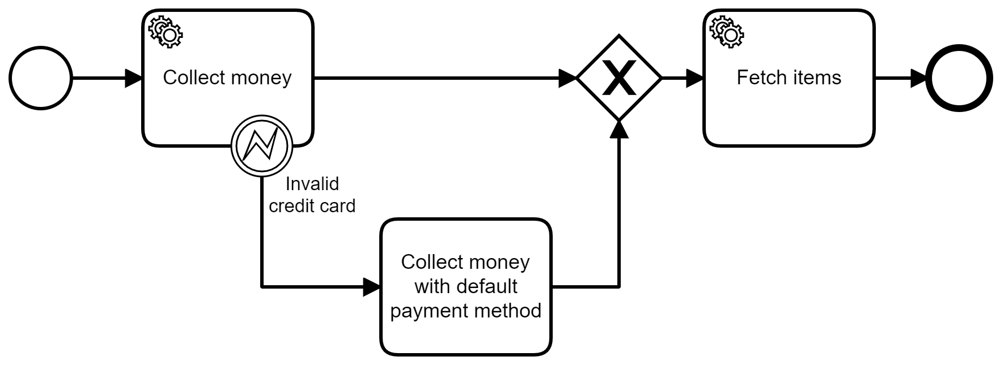

In process automation, you may encounter errors related to the process, also known as business errors. 

These business errors may include the following:

- An invalid credit card was used as the default payment method to collect money.
- An order was canceled after it was already paid for.

When you encounter a business error, you may need to take a different path than usual or compensate for the error.



## Defining the error

In BPMN, business errors are represented as errors and error events. **Errors** define the possible errors that can occur. **Error events** are elements in the process that refer to the defined errors. An error can be referenced by one or more error events.

An error must define an `errorCode` (e.g. `Invalid Credit Card`). The `errorCode` is a `string` used to match a thrown error to the error catch events.

## Throwing the error

An error can be thrown from within the process using an error **end event**.


Alternatively, you can inform Zeebe that a business error has occurred using a **client command**. This throw error client command can only be used while processing a job.

In addition to throwing the error, this also disables the job and stops it from being activated or completed by other job workers. See the [gRPC command](/reference/grpc.md#throwerror-rpc) for details.

## Catching the error

A thrown error can be caught by an error catch event. Specifically, using an error **boundary event** or an error **event subprocess**.

Starting at the scope where the error was thrown, the error code is matched against the attached error boundary events and error event sub processes at that level.

An error is caught by the first event in the scope hierarchy that matches the error code. At each scope, the error is either caught, or propagated to the parent scope.

If the process instance is created via call activity, the error can also be caught in the calling parent process instance.

Error boundary events and error event subprocesses must be interrupting. This means the process instance will not continue along the regular path when the error was caught. Instead, it continues where the error is caught.

If the error is thrown for a job, the associated task is terminated first. To continue the execution, the error boundary event or error event subprocess that caught the error are activated.

## Unhandled errors

When an error is thrown it should be caught. If it is not caught, an **incident** (i.e. `Unhandled error event`) is raised to indicate the failure. The incident is attached to the corresponding element where the error was thrown (i.e. the task of the processed job or the error end event).

When you resolve the incident attached to a task, it ignores the error, re-enables the job, and allows it to be activated and completed by a job worker once again.

The incident attached to an error end event cannot be resolved by a user because the failure is in the process itself. The process cannot be changed to catch the error for this process instance.

## Business error vs. technical error

While processing a job, two different types of errors can occur:

- A technical error (e.g. database connection interrupted)
- A business error (e.g. invalid credit card)

A technical error is usually unexpected and should not be dealt with in the process. The error may disappear when the job is retried, or an incident is created to indicate a user interaction is required.

A business error is expected and should be dealt with in the process. The process may take a different path to compensate for the error or undo previous actions.

## Additional resources

 ### XML representation
 
A boundary error event:

```xml
<bpmn:error id="invalid-credit-card-error" errorCode="Invalid Credit Card" />

<bpmn:boundaryEvent id="invalid-credit-card" name="Invalid Credit Card" attachedToRef="collect-money">
 <bpmn:errorEventDefinition errorRef="invalid-credit-card-error" />
</bpmn:boundaryEvent>

```

### References

- [Incidents](/product-manuals/concepts/incidents.md)
