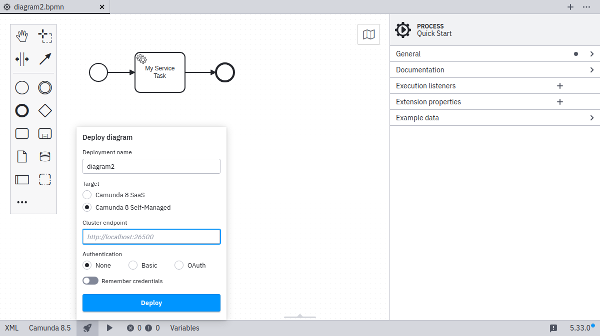
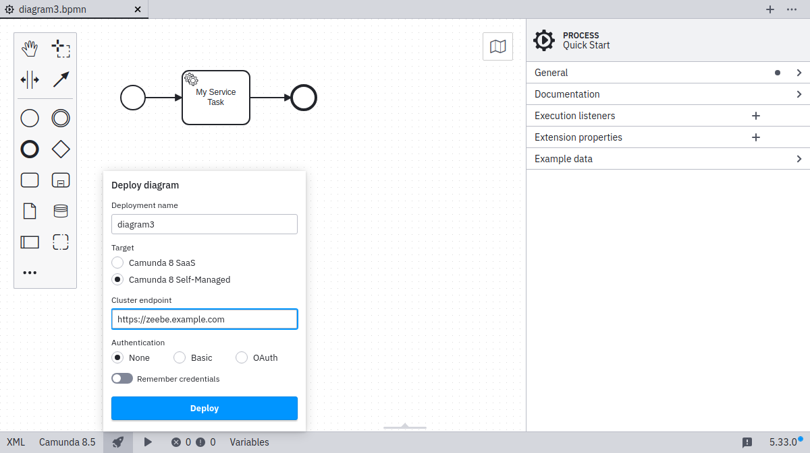
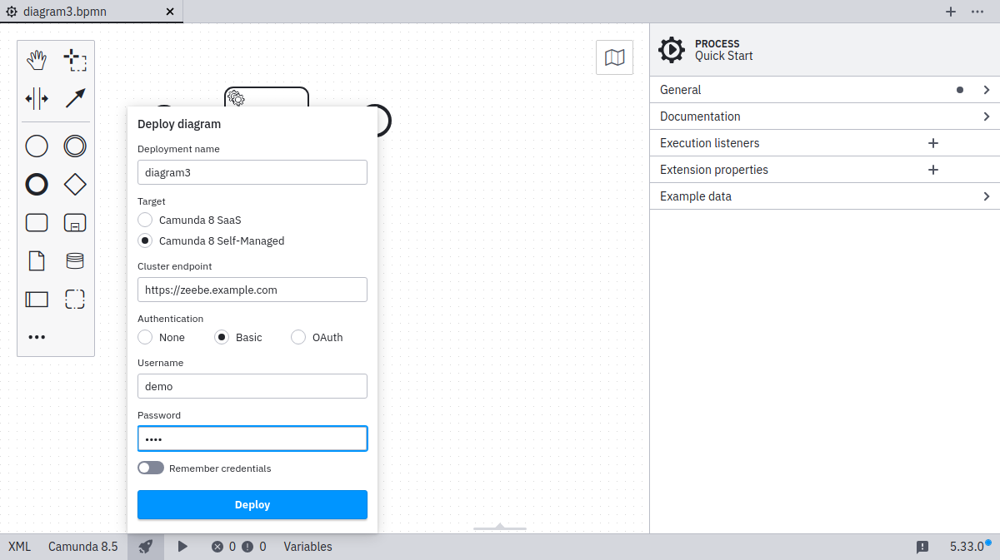
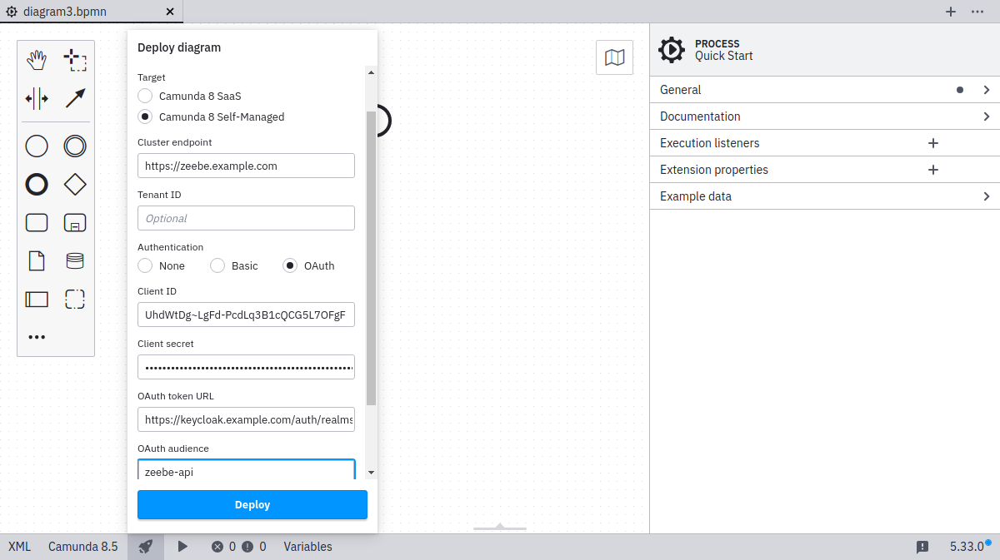
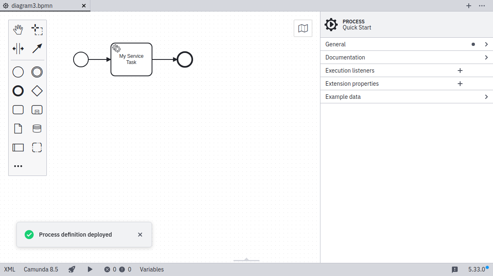

import Tabs from "@theme/Tabs";
import TabItem from "@theme/TabItem";

Desktop Modeler can directly deploy diagrams and start process instances in Camunda 8 Self-Managed. Follow the steps below to deploy a diagram:

1. Click the rocket-shaped deployment icon:

   

2. Click **Camunda 8 Self-Managed**:

   

3. Input the `Cluster endpoint`:

   :::note
   You can connect to Camunda 8 both securely and insecurely through the `https` and `http` protocols.

   Secured connections to a remote endpoint will only be established if the remote server certificate is trusted by the app. Ensure that signing trusted roots and intermediate certificates [are known to the app](/components/modeler/desktop-modeler/flags/flags.md#zeebe-ssl-certificate).
   :::

   :::caution

   Multi-tenancy is only available with authentication enabled [through Identity](/self-managed/identity/what-is-identity.md), and [enabled in all required components](/self-managed/concepts/multi-tenancy.md).

   :::

   

4. Select your authentication method, and input the required credentials:

<Tabs groupId="auth" defaultValue="basic" queryString values={
[
{label: 'Basic', value: 'basic' },
{label: 'OAuth', value: 'oauth' }
]}>

<TabItem value='basic'>

For **basic authentication**, input your username and password:

</TabItem>

<TabItem value='oauth'>

For **OAuth**, input the credentials for your OAuth provider, as configured in your Zeebe [environment variables](/self-managed/zeebe-deployment/security/client-authorization.md#oauthcredentialsprovider):

| Name            | Description                                                        | Example value                                                                             |
| --------------- | ------------------------------------------------------------------ | ----------------------------------------------------------------------------------------- |
| Client ID       | The name of your Zeebe client, found in your Identity console.     | `zeebe`                                                                                   |
| Client secret   | The password of your Zeebe client, found in your Identity console. | `zecret`                                                                                  |
| OAuth token url | The full path to the token endpoint.                               | `https://<keycloak base url>/auth/realms/camunda-platform/protocol/openid-connect/token`. |
| OAuth audience  | The permission name for Zeebe.                                     | `zeebe-api`                                                                               |

</TabItem>
</Tabs>

1. Select the **Remember** checkbox if you want to locally store the connection information.

2. Click **Deploy** to perform the deployment.

