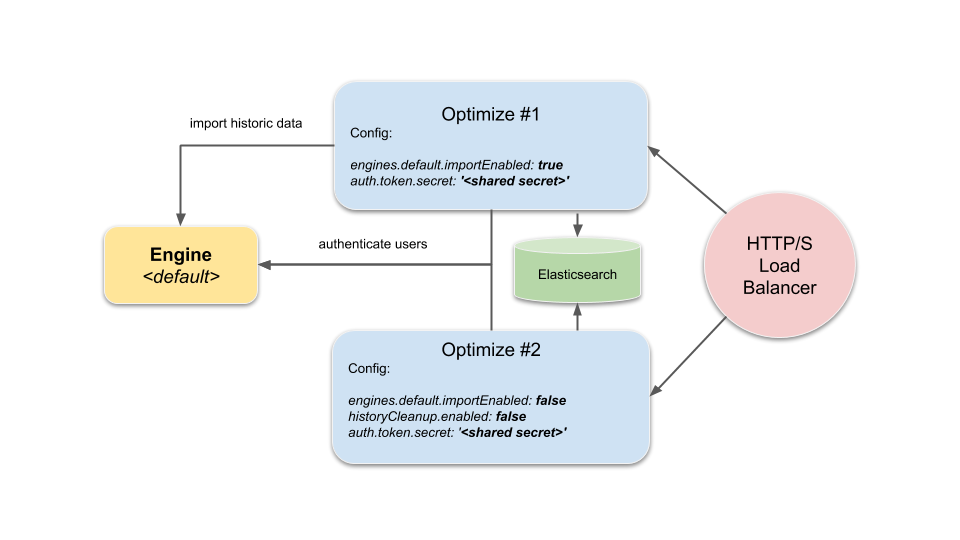

This document describes the set up of a Camunda Optimize cluster which is mainly useful in a failover scenario, but also provides means of load-balancing in terms of distributing import and user load.

## Configuration

There are two configuration requirements to address in order to operate Camunda Optimize successfully in a cluster scenario.
Both of these aspects are explained in detail in the following subsections.

### 1. Import - define importing instance

<span class="badge badge--platform">Camunda Platform 7 only</span>

It is important to configure the cluster in the sense that only one instance at a time is actively importing from a particular Camunda Platform 7 engine.

:::note Warning
If more than one instance is importing data from one and the same Camunda Platform 7 engine concurrently, inconsistencies can occur.
:::

The configuration property [`engines.${engineAlias}.importEnabled`](./system-configuration.md#connection-to-camunda-platform-7) allows to disable the import from a particular configured engine.

Given a simple failover cluster consisting of two instances connected to one engine, the engine configurations in the `environment-config.yaml` would look like the following:

Instance 1 (import from engine `default` enabled):

```
...
engines:
  'camunda-bpm':
    name: default
    rest: 'http://localhost:8080/engine-rest'
    importEnabled: true
...
```

Instance 2 (import from engine `camunda-bpm` disabled):

```
...
engines:
  'camunda-bpm':
    name: default
    rest: 'http://localhost:8080/engine-rest'
    importEnabled: false

historyCleanup:
  enabled: false
...
```

:::note
Tthe second non-importing instance has the [history cleanup disabled](./system-configuration.md#history-cleanup-settings). It is strongly reccommended to do this for all non-importing Optimize instances in the cluster to prevent any conflicts when the [history cleanup](../history-cleanup/) is performed.
:::

### 1.1 Import - event based process import

<span class="badge badge--platform">Camunda Platform 7 only</span>

In the context of event-based process import and clustering, there are two additional configuration properties to consider carefully.

One is specific to each configured Camunda engine [`engines.${engineAlias}.eventImportEnabled`](./system-configuration.md#connection-to-camunda-platform-7) and controls whether data from this engine is imported as event source data as well for [event-based processes](./../../../components/optimize/userguide/additional-features/event-based-processes.md). You need to enable this on the same cluster node for which the [`engines.${engineAlias}.importEnabled`](./system-configuration.md#connection-to-camunda-platform-7) configuration flag is set to `true`.

[`eventBasedProcess.eventImport.enabled`](./system-configuration.md#event-based-process-configuration) controls whether the particular cluster node processes events to create event based process instances. This allows you to run a dedicated node that performs this operation, while other nodes might just feed in Camunda activity events.

### 2. Distributed user sessions - configure shared secret token

If more than one Camunda Optimize instance are accessible by users for e.g. a failover scenario a shared secret token needs to be configured for all the instances.
This enables distributed sessions among all instances and users do not lose their session when being routed to another instance.

The relevant configuration property is [`auth.token.secret`](./system-configuration.md#security) which needs to be configured in the `environment-configuration.yaml` of each Camunda Optimize instance that is part of the cluster.

It is recommended to use a secret token with a length of at least 64 characters generated using a sufficiently good random number generator, for example the one provided by `/dev/urandom` on Linux systems.

The following example command would generate a 64-character random string:

```
< /dev/urandom tr -dc A-Za-z0-9 | head -c64; echo
```

The corresponding `environment-config.yaml` entry would look the **same for all instances of the cluster**:

```
auth:
  token:
    secret: '<your secret 64 character string>'
```

## Example setup

The tiniest cluster setup consisting of one importing instance from a given `default` engine and another instance where the import is disabled would look like the following:



The HTTP/S Load-Balancer would route user requests to either of the two instances, while Optimize #1 would also care about importing data from the engine to the shared
Elasticsearch instance/cluster and Optimize #2 only accesses the engine in order to authenticate and authorize users.
