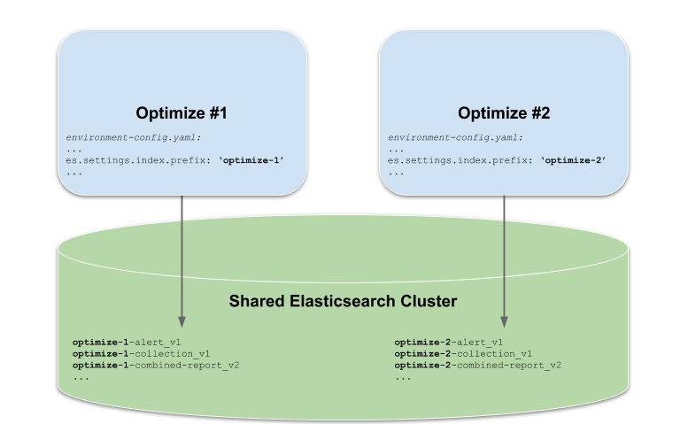

In case you have a large shared Elasticsearch cluster that you want to operate multiple Optimize instances on that are intended to run in complete isolation from each other, it is required to change the [`es.settings.index.prefix`](../configuration/#index-settings) setting for each Optimize instance.

:::note Heads Up!
Please note that although a shared Elasticsearch cluster setup is possible, it's recommended to operate a dedicated Elasticsearch cluster per Optimize instance.
This is due to the fact that a dedicated cluster provides the highest reliability (no resource sharing and no breaking side effects due misconfiguration) and flexibility (e.g. Elasticsearch and/or Optimize updates can be performed independently between different Optimize setups).
:::

The following illustration demonstrates this use case with two Optimize instances that connect to the same Elasticsearch cluster but are configured with different `es.settings.index.prefix` values. This results in different indexes and aliases created on the cluster, strictly isolating the data of both Optimize instances, so no instance accesses the data of the other instance.

:::note Warning
Please note that changing the value of `es.settings.index.prefix` after an instance was already running results in new indexes being created with the new prefix value. There is no support in migrating data between indexes based on different prefixes.
:::

