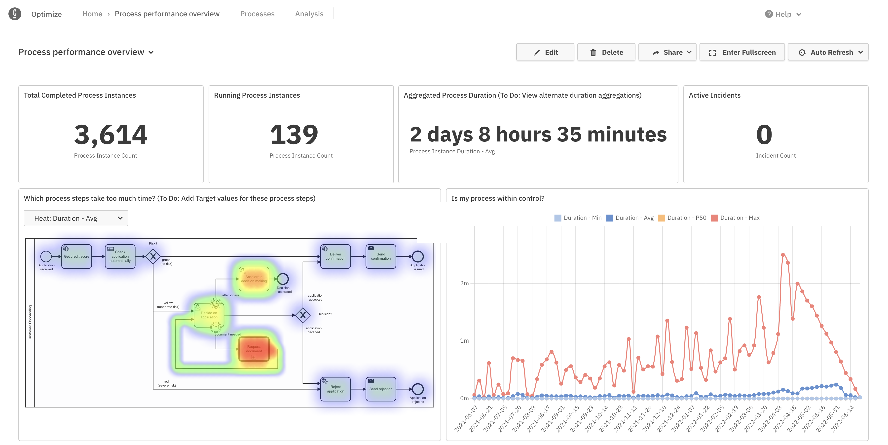

:::note
New to Optimize? Visit our introductory guide to [Optimize]($docs$/guides/improve-processes-with-optimize) to get started.
:::

Camunda Platform 8 is built to handle three key aspects of process automation:

- Design
- Automate
- Improve

A user can design process flows through our [Modeler]($docs$/components/modeler/about-modeler). In a production scenario, you can deploy through Desktop Modeler, Web Modeler, or programmatically. A user can use [Tasklist]($docs$/components/tasklist/introduction-to-tasklist) to review and complete tasks, and [Operate]($docs$/components/operate/operate-introduction) to view and analyze process instances.

Beyond these design and automate cornerstones lies an important component to leverage our process data and analyze areas for improvement: Optimize.

Geared toward business stakeholders, Optimize offers business intelligence tooling for Camunda enterprise customers. By leveraging data collected during process execution, you can access reports, share process intelligence, analyze bottlenecks, and examine areas in business processes for improvement.

As you run process instances through the server, Optimize makes REST API calls into the Camunda server, takes new historical data generated since the previous call, and stores the data in its own Elasticsearch database.

As a result, you can analyze reports and dashboards, and reap actionable insights independently of what is happening inside the Camunda server itself (meaning no effects on runtime).

Review heatmap displays for a closer look at the number of instances that took longer than average, based on duration distribution. You can also visualize a heatmap by counting the number of activity instances, comparing them to the total number of process instances, and obtaining a percentage.

Unlike standard business intelligence tools, Optimize understands the user’s goals and leads them through continuous process improvement. Optimize is purpose-built to help rapidly identify the constraints of your system.

In the following sections, we’ll walk through using and analyzing Optimize.
