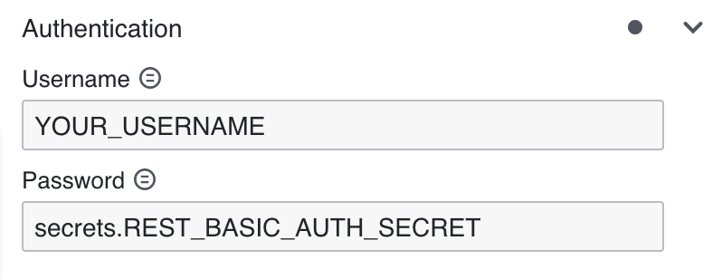
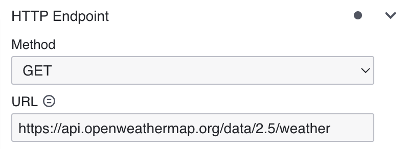
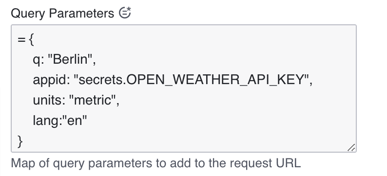
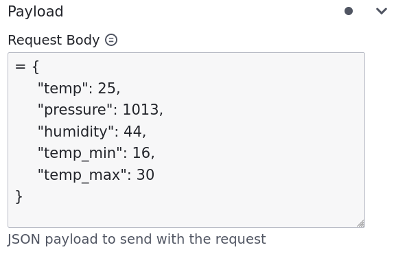
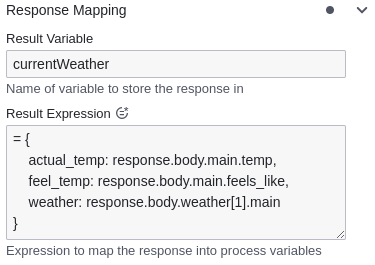

The **REST connector** allows you to make a request to a REST API and use the response in the next steps of your process.

## Create a REST connector task

To use a **REST connector** in your process, either change the type of existing task using the wrench-shaped **Change type** context menu, or create a new connector task by using the **Append connector** context menu. Follow [our guide on using connectors](../use-connectors.md) to learn more.

## Make your REST connector executable

To make the **REST connector** executable, fill out the mandatory fields highlighted in red in the properties panel:


:::note
All the mandatory and non-mandatory fields will be covered in the upcoming sections. Depending on the authentication selection you make, more fields might be required. We will also cover this in the next section.
:::

### Authentication

You can choose among the available REST connectors according to your authentication requirements.

#### REST Connector (No Auth)

No extra authentication configuration is required; you can jump to the [next section](#request).

#### REST Connector (Basic Auth)

##### Create a new connector Secret

We advise you to keep your **Password** safe and avoid exposing it in the BPMN `xml` file by creating a Secret:

1. Follow our [guide for creating Secrets](../../../../console/manage-clusters/manage-secrets.md).
2. Name your Secret (i.e `REST_BASIC_AUTH_SECRET`) so you can reference it later in the connector.

### Configure Basic Authentication

Select the **REST Connector** and fill out the following properties under the **Authentication** section:

1. Set **Username** (i.e. `YOUR_USERNAME`).
2. Set **Password** to the secret you created (i.e. `secrets.REST_BASIC_AUTH_SECRET`).



### REST Connector (Bearer Token Auth)

#### Create a new connector Secret

We advise you to keep your **Bearer Token** safe and avoid exposing it in the BPMN `xml` file by creating a Secret:

1. Follow our [guide for creating Secrets](../../../../console/manage-clusters/manage-secrets.md).
2. Name your Secret (i.e `REST_BEARER_TOKEN`) so you can reference it later in the connector.

#### Configure the Bearer Token

Select the **REST Connector** and fill out the following properties under the **Authentication** section:

1. Set **Bearer** to the secret you created (i.e. `secrets.REST_BEARER_TOKEN`).


## Request

Under the **HTTP Endpoint** section, select the desired **Method** and fill the **URL** with your desired REST API.



### Query Parameters

The **Query Parameters** field can be configured using the  [FEEL Map](https://camunda.github.io/feel-scala/docs/reference/language-guide/feel-data-types/#context) data type.

```text
= {
    q: "Berlin",
    appid: "secrets.OPEN_WEATHER_MAP_API_KEY",
    units: "metric",
    lang:"en"
}
```

:::note
Secrets are not like regular variables and must be wrapped in double quotes (`"`) when used in an expression.
:::



### Http Headers

Similarly to the Query Parameters, the **Http Headers** can be specified using the  [FEEL Map](https://camunda.github.io/feel-scala/docs/reference/language-guide/feel-data-types/#context) data type.

```text
= {
    Origin: "https://modeler.cloud.camunda.io/"
}
```


### Request Body

When you are making a PUT, POST, or PATCH request, you might need to provide a body.
You can provide a body for your request under the **Payload** section in the **Request Body** field.

Be aware that **REST connector** is supporting only JSON payload.

:::note
Secrets are currently not supported in the body of a REST connector.
:::

```json
= {
     "temp": 25,
     "pressure": 1013,
     "humidity": 44,
     "temp_min": 16,
     "temp_max": 30
}
```



## Response

The HTTP response will be available in a temporary local `response` variable. This variable can be mapped to the process by specifying the **Result Variable**.

The following fields are available in the `response` variable:

- **status**: Response status
- **body**: Response body of your request
- **headers**: Response headers

Additionally, you can choose to unpack the content of your `response` into multiple process variables using the  **Result Expression**, which is a [FEEL Context Expression](/components/modeler/feel/language-guide/feel-context-expressions.md).

```text
= {
    actual_temp: response.body.main.temp,
    feel_temp: response.body.main.feels_like,
    weather: response.body.weather[1].main
}
```



The next steps in your process will have access to the `currentWeather` variable that will contain the full response and the mapped variables from the result expression: `actual_temp`, `feel_temp`, and `weather`.

:::note
Now you can [deploy and start a new instance](../../save-and-deploy.md) of your process. As with all connectors, the runtime is available out of the box in Camunda Platform 8 SaaS.
:::
