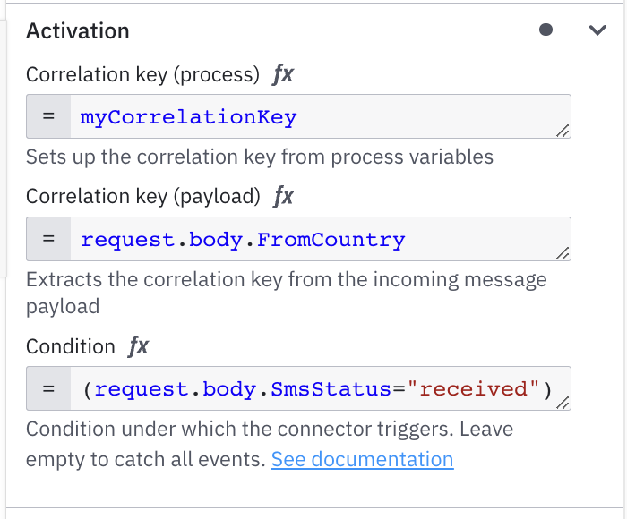
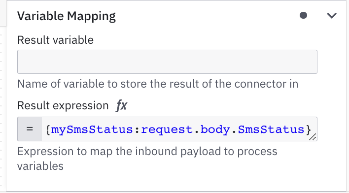

The **Twilio Webhook Connector** is an inbound Connector that enables you to start a BPMN process instance triggered by a [Twilio event](https://www.twilio.com/docs/usage/webhooks).

:::note
If you have used the **Twilio Webhook Connector** with a self-managed Camunda 8 configuration before the Connector SDK [0.7.0 release](https://github.com/camunda/connector-sdk/releases/tag/0.7.0), you might need to manually replace the element template. Please refer to the [update guide](/guides/update-guide/connectors/060-to-070.md) for more details.
:::

## Create a Twilio Webhook Connector task

1. Start building your BPMN diagram. You can use the **Twilio Webhook Connector** with either a **Start Event** or an **Intermediate Catch Event** building block.
2. Select the applicable element and change its template to a **Twilio Webhook Connector**.
3. Fill in all required properties.
4. Complete your BPMN diagram.
5. Deploy the diagram to activate the webhook.
6. Navigate to the **Webhooks** tab in the properties panel to see the webhook URL.
7. Run the process if you use the **Twilio Webhook Intermediate Catch Event Connector**, and only deploy the process if the diagram starts from the **Start Event**.

## Make your Twilio Webhook Connector for receiving messages executable

### Fill properties in the **Webhook Configuration** section

1. Choose one of the required methods in the **Webhook method** property. For example, if you know that the webhook will be triggered by the 'POST' method, choose 'POST'. Alternatively, if it is not essential to specify a specific method for the webhook trigger, select 'ANY'.
2. Configure the **Webhook ID**. By default, the **Webhook ID** is pre-filled with a random value. This value will be part of the Webhook URL. For more details about Twilio Webhook URLs, refer to the section [below on activating the Twilio Webhook Connector by deploying your diagram](#activate-the-twilio-webhook-connector-by-deploying-your-diagram).
3. Select 'Enabled' in **HMAC authentication** if you want to use HMAC authentication. After that, set the [Twilio Auth Token](https://support.twilio.com/hc/en-us/articles/223136027-Auth-Tokens-and-How-to-Change-Them) as the shared secret key in the **HMAC secret key** field property.

:::note
It is recommended to use Camunda secrets to store your credentials securely. Refer to the [Camunda secrets documentation](/components/console/manage-clusters/manage-secrets.md) for more details.
:::

### Fill properties in the **Activation** section

1. (Optional) Configure the **Activation Condition**. For example, if an external message has the body:

   ```
   {
     "body": {
       "ApiVersion": "2010-04-01",
       "FromCountry": "EU",
       "Body": "Hello world",
       "SmsStatus": "received"
       ...
     }
     ...
   }
   ```

   the **Activation Condition** value might look like this:

   ```
   =(request.body.SmsStatus="received")
   ```

   Leave this field empty to receive all messages every time.

2. When using the **Twilio Webhook Connector** with an **Intermediate Catch Event**, fill in the **Correlation key (process)** and **Correlation key (payload)**.

- **Correlation key (process)** is a FEEL expression that defines the correlation key for the subscription. This corresponds to the **Correlation key** property of a regular **Message Intermediate Catch Event**.
- **Correlation key (payload)** is a FEEL expression used to extract the correlation key from the incoming message. This expression is evaluated in the Connector Runtime, and the result is used to correlate the message.

For example, if your correlation key is defined with a process variable named `myCorrelationKey`, and you want to correlate by the `FromCountry` property in the request body, which contains:

```
{
  "body": {
    "ApiVersion": "2010-04-01",
    "FromCountry": "EU",
    "Body": "Hello world",
    "SmsStatus": "received"
    ...
  }
  ...
}
```

your correlation key settings will look like this:

- **Correlation key (process)**: `=myCorrelationKey`
- **Correlation key (payload)**: `=request.body.FromCountry`

Learn more about correlation keys in the [messages guide](../../../concepts/messages).



## Activate the Twilio Webhook Connector by deploying your diagram

Once you click the **Deploy** button, your Twilio Webhook will be activated and publicly available.

The URLs of the exposed Twilio Webhooks adhere to the following pattern:

`http(s)://<base URL>/inbound/<webhook ID>`

- `<base URL>` is the URL of the Connectors component deployment. When using the Camunda Platform 8 SaaS offering, this will typically contain your cluster region and cluster ID.
- `<webhook ID>` is the ID (path) you configured in the properties of your Twilio Webhook Connector.

If you make changes to your Twilio Webhook Connector configuration, you need to redeploy the BPMN diagram for the changes to take effect.

When you click on the event with the Twilio Webhook Connector applied to it, a new **Webhooks** tab will appear in the properties panel.
This tab displays the URL of the Twilio Webhook Connector for every cluster where you have deployed your BPMN diagram.

:::note
The **Webhooks** tab is only supported in Web Modeler as part of the Camunda Platform 8 SaaS offering.
You can still use the Twilio Webhook Connector in the Desktop Modeler or with Camunda Platform 8 Self-Managed.
In that case, Twilio Webhook Connector deployments and URLs will not be displayed in the Modeler.
:::

## Variable mapping

The **Variable mapping** section allows you to configure the mapping of the webhook request to the process variables.

- Use the **Result variable** to store the response in a process variable. For example, `myResultVariable`.
- Use the **Result expression** to map specific fields from the response into process variables using [FEEL](/components/modeler/feel/what-is-feel.md). For example, given that the **Twilio Webhook Connector** is triggered with the webhook:

  ```
  {
    "body": {
      "ApiVersion": "2010-04-01",
      "FromCountry": "EU",
      "Body": "Hello world",
      "SmsStatus": "received"
      ...
    }
    ...
  }
  ```

  and you would like to extract the `SmsStatus` as a process variable `mySmsStatus`, the **Result Expression** might look like this:

  ```
  = {
    mySmsStatus: request.body.SmsStatus
  }
  ```

  

## Configure your Twilio account

To set a webhook URL in Twilio for SMS, follow these steps:

1. Log in to your Twilio account at [www.twilio.com/console](https://www.twilio.com/console).
2. Navigate to the "Phone Numbers" section, which you can find in the left-hand side menu.
3. Click on the phone number for which you want to set the webhook URL.
4. Scroll down to the **Messaging** section and locate the **A message comes in** field.
5. In the input box next to **A message comes in**, enter the URL where you want Twilio to send incoming SMS messages and choose the required method.
6. Save your changes.

Once you have set the webhook URL, Twilio will send a `POST` or `GET` request to that URL whenever an incoming SMS message is received on the specified phone number.

## Next steps

- Learn more about [Twilio webhooks](https://docs.github.com/en/developers/webhooks-and-events/webhooks/about-webhooks).
- Read the [Twilio webhooks FAQ](https://www.twilio.com/docs/usage/webhooks/webhooks-faq).
- Understand [Twilio webhooks security](https://www.twilio.com/docs/usage/webhooks/webhooks-security).
- Learn about [other connectors available](./available-connectors-overview.md) in Camunda to integrate with different systems and services.
- Learn more about using connectors [here](../use-connectors/index.md).
- Learn more about inbound connectors [here](../use-connectors/inbound.md).
